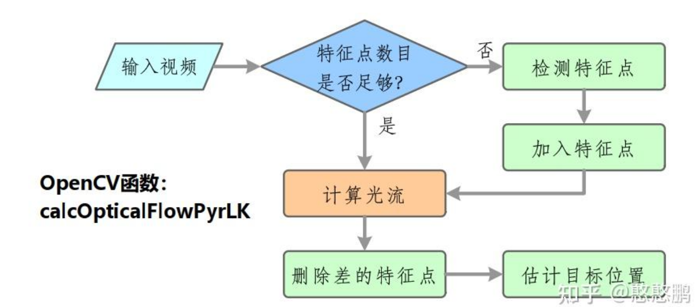
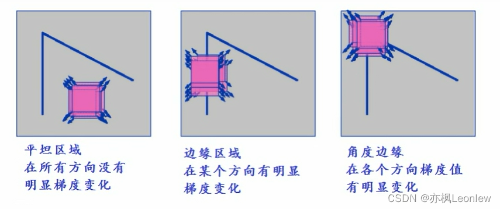
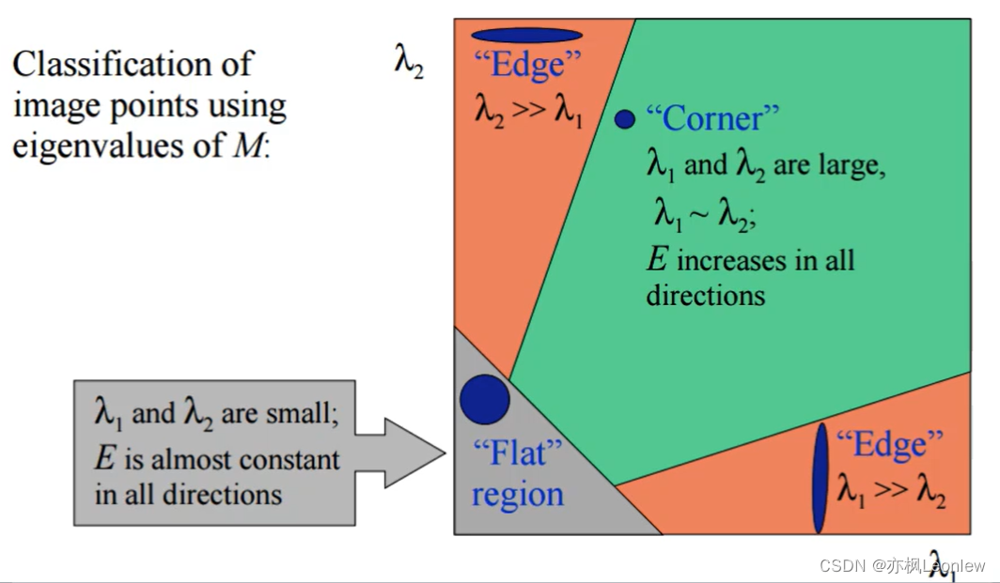
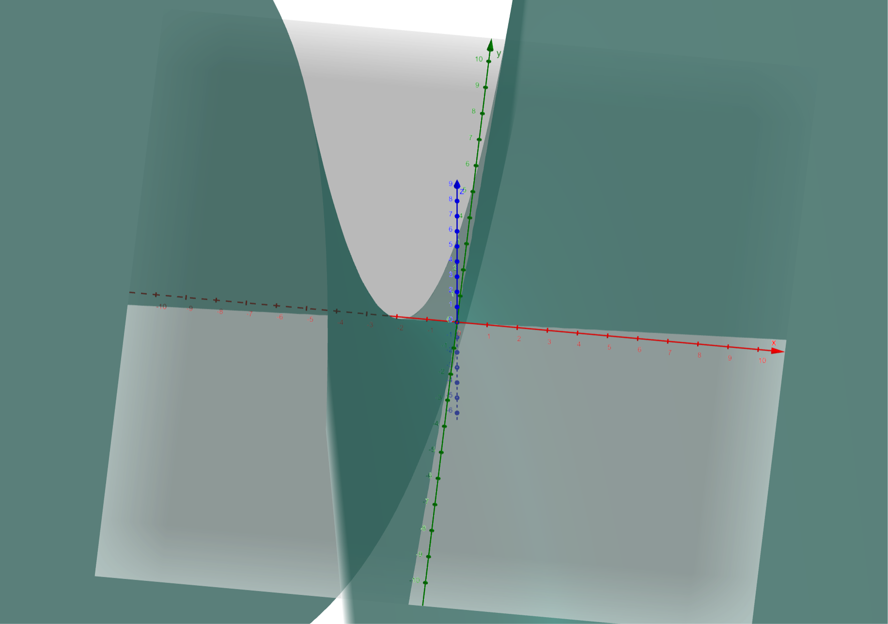
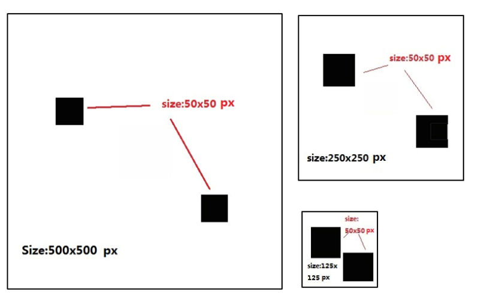

# Camera

### 小孔成像

- 小孔越大，图像越亮但越模糊；小孔越小，图像越清晰但越暗。
- 不同距离的物体成像清晰度也受孔径影响。

------

### 焦距（Focal Length）

- 镜头主点到感光元件的距离。
- 焦距越长，看得越远、视野越窄；焦距越短，视野越宽。

------

### 视场角（FOV）

- 镜头能看到的范围。
- 焦距越长 → FOV 越小；焦距越短 → FOV 越大。
- Zoom （放大倍率）值和焦距有关，反映视野变化。

------

### 光圈（Aperture）

- 凸透镜后的可调小孔，用 f 值表示（如 f/2.8）。
- 光圈大（f 小）：进光多、景深浅、快门快。
- 光圈小（f 大）：进光少、景深深、快门慢。

------

### 景深（Depth of Field）

- 图像中前后清晰的范围。
- 光圈越小、焦距越短、拍摄距离越远 → 景深越深。

------

### 成像色差 & 畸变

- 色差：不同颜色聚焦点不同 → 图像边缘会有色散。
- 畸变：成像几何变形，影响点的位置，常见有桶形、枕形。

### 相机坐标系

 在相机的成像模型和三维重建原理中都存在坐标系的转换，我们可以从上面的相机模型中深刻的体会到这一点。坐标转换涉及的坐标系主要有：**世界坐标系、相机坐标系、归一化坐标系、图像坐标系、像素坐标系**这五大坐标系

| 坐标系               | 原点位置                 | 坐标单位 | 坐标轴表示                      | 主要用途与意义                                           |
| -------------------- | ------------------------ | -------- | ------------------------------- | -------------------------------------------------------- |
| **世界坐标系** $map$ | 由用户指定（如地面原点） | 米（m）  | $O_{w}-x_{w}-y_{w}-z_{w}$       | 定义场景中所有物体的位置和姿态，是全局参考坐标系         |
| **相机坐标系**       | 相机光心（即镜头中心）   | 米（m）  | $O_{c}-x_{c}-y_{c}-z_{c}$       | 一个**三维坐标系**，用来描述**物体在相机前面的空间位置** |
| **图像坐标系**       | 图像中心                 | 像素     | $O_{image}-x_{image}-y_{image}$ | 将归一化坐标映射到成像平面，用于投影建模                 |
| **归一化坐标系**     | 相机光心对应的图像中心   | 1        | $O_{s}-x_{s}-y_{s}$             | 用于投影建模（消除相机内参影响），单位焦距成像平面       |
| **像素坐标系**       | 图像左上角 (0, 0)        | 像素     | $O_{pixel}-u-v$                 | 图像处理中的基本坐标系，如 OpenCV 使用的坐标系统         |

- **世界坐标系 $O_w$ ——>相机坐标系 $O_c$ （外参变换）** 
  $$
  \begin{bmatrix}
  x_c\\
  y_c\\
  z_c\\
   \end{bmatrix} =  
   R
   \begin{bmatrix}
  x_w\\
  y_w\\
  z_w\\
   \end{bmatrix}
   +T
  $$
  
- **相机坐标系$O_c$ ——>归一化坐标系$O_{s}$** 
  $$
  \frac{x_c}{x_s}=
  \frac{y_c}{y_s}=
  \frac{z_c}{1}
  $$
  
  - 解出
  
  $$
  x_s = \frac{x_c}{z_c} \\
  y_s = \frac{y_c}{z_c} \\
  $$
  
- **归一化坐标系$O_{s}$——>像素坐标系$O_{pixel}$** 
  
  - 由于两者坐标系的单位不一样，相机坐标系为m，图像坐标系为像素，所以要乘一个 $\Delta x$ 和 $\Delta y$ （$\Delta x$ 为水平方向每个像素的宽度，$\Delta y$ 同理）
  
  
  $$
  u = \frac{x_s}{\Delta x} + c_x \\
  v = \frac{y_s}{\Delta y} + c_y \\
  $$
  
  
  
- **最后，相机坐标系$O_c$ ——>像素坐标系$O_{pixel}$ ** 
  
  - 令 $f_x = \frac{x_c}{\Delta x}$，$f_y = \frac{y_c}{\Delta y}$ 
  
  $$
  u = \frac{f_x}{z_c} + c_x \\
  v = \frac{f_y}{z_c} + c_y \\
  $$
  
  - 令 $f_x =\frac{x_c}{z_c} f_y = \frac{y_c}{z_c}$ ，得
  
  $$
  \begin{bmatrix}
  u\\
  v\\
  1\\
  \end{bmatrix} = 
  \begin{bmatrix}
  f_x & 0 & c_x\\
  0 & f_y & c_y\\
  0 & 0 & 1  \\
  \end{bmatrix}
  \begin{bmatrix}
  1 \\
  1 \\
  1 \\
  \end{bmatrix}
  $$
  
  

# CLAHE：限制对比度的自适应直方图均衡化

一个图像增强的算法，先咕一会，跳过这一部分。

有一篇写的挺好的博客可以参考：[https://blog.csdn.net/qq_36926037/article/details/108679704](https://blog.csdn.net/qq_36926037/article/details/108679704)

# Kanade–Lucas–Tomasi（KLT稀疏光流算法）

**核心思想**：在金字塔图像（多分辨率）上，对每个特征点构建邻域窗口，假设该窗口内所有像素具有相同的位移，利用泰勒一阶展开并通过最小二乘法求解位移。

**稀疏光流和稠密光流之间的区别：** 相较于密集光流（如 Farneback、TV-L1），KLT 只跟踪稀疏特征点，计算开销更小，便于实时 SLAM。

大致流程：



## Shi-tomasi（角点检测）

在介绍 Shi-tomasi 角点检测之前，先介绍 Harris 角点检测，Shi-tomasi 是在 Harris 基础上做了小的改进。

### Harris 角点检测

点角的特征：



对于某一时刻内一个窗口区域，不同方向像素值的梯度变化，可以用公式表示为：

```math
E(u, v) = \sum_{x,y} w(x, y) [I(x+u, y+v) - I(x, y)]^2 \tag{1}
```

其中：

- $I(x, y)$ 是对应坐标的像素值；
- $w(x, y)$ 是对应坐标的权重。

对于 $I(x+u, y+v)$，进行二元函数泰勒一阶展开，得：

```math
I(x+u, y+v) \approx I(x, y) + uI_x(x, y) + vI_y(x, y)
```

将上式代入公式 (1) 后得：

```math
E(u, v) = \sum_{x,y} w(x, y) [uI_x(x, y) + vI_y(x, y)]^2
```

展开后可以写成矩阵形式：

```math
E(u, v) = \sum_{x,y} w(x, y)
\begin{bmatrix}
u & v
\end{bmatrix}
\begin{bmatrix}
I_x^2 & I_x I_y \\
I_x I_y & I_y^2
\end{bmatrix}
\begin{bmatrix}
u\\
v
\end{bmatrix}
```

令：

```math
M = \sum_{x,y} w(x, y)
\begin{bmatrix}
I_x^2 & I_x I_y \\
I_x I_y & I_y^2
\end{bmatrix}
```

则 $E(u,v)$ 可简写为：

```math
E(u, v) =
\begin{bmatrix}
\nu & v
\end{bmatrix}
M
\begin{bmatrix}
\nu\\
v
\end{bmatrix} \tag{2}
```

其中，$M$ 是一个实对称矩阵，即存在正交矩阵 $P$，使得：

```math
P^{-1} M P =
\begin{bmatrix}
\lambda_1 & 0 \\
0 & \lambda_2
\end{bmatrix}
```

**$\lambda_1$ 、$\lambda_2$ 是 $M$ 的特征值 **

$P$ 是正交矩阵，有 $ P^T = P^{-1} $ ，有

$$
M = P 
\begin{bmatrix}
 \lambda_1&0\\
 0 & \lambda_2
 \end{bmatrix}
 P^{-1} = 
 P
 \begin{bmatrix}
 \lambda_1&0\\
 0 & \lambda_2
 \end{bmatrix}
 P^T
$$

$M$ 带入得 $(2)$ 得：

$$
E(u, v) =
\begin{bmatrix}
 u & v\\
 \end{bmatrix}
 P
 \begin{bmatrix}
 \lambda_1&0\\
 0 & \lambda_2
 \end{bmatrix}
 P^T
\begin{bmatrix}
 u & v\\
 \end{bmatrix}^T \\
 E(u, v) =
 \begin{bmatrix}
 u & v\\
 \end{bmatrix}
 P
 \begin{bmatrix}
 \lambda_1&0\\
 0 & \lambda_2
 \end{bmatrix}
 (
\begin{bmatrix}
 u & v\\
 \end{bmatrix}
 P)^T
$$

令

$$
\begin{bmatrix}
 u & v\\
 \end{bmatrix}
 P = 
\begin{bmatrix}
 u' & v'\\
 \end{bmatrix}
$$

得：

$$
E(u, v) = (u')^2 \lambda_1 + (v')^2 \lambda_2 =
\frac{(u')^2 }{(\frac{1}{\lambda_1^{1/2}})^2} 
+
\frac{(v')^2 }{(\frac{1}{\lambda_2^{1/2}})^2}
\tag3
$$

这样的格式和标准椭圆方程一致，椭圆方程：

$$
\frac{x^2}{(\frac{a}{\sigma})^2}+\frac{y^2}{(\frac{b}{\sigma})^2}= \sigma^2
$$

根据 $(3)$ 式，所以 $\lambda_1$ 和 $\lambda_2$ 都要比较大时，像素的梯度变化才比较大，如下图：



#### 响应函数R

前面已经知道如何计算某一个像素点的像素大小的变化梯度了，现在计算 $\lambda_1$ 、$\lambda_2$ 就可以得到梯度，但是如果按照前面的流程计算 $M$ 的特征值的话，太过复杂，有没有比较好的办法不用求它们的值，通过矩阵的一些性质就能估算出$\lambda_1$ 、$\lambda_2$ 大小呢？

因为 $M$ 是对称矩阵，所以其矩阵的 det（行列式）和 trace（迹）有以下关系：

$$
det M = \lambda_1\lambda_2 \\
trace M = \lambda_1+\lambda_2
$$

因为矩阵的迹（矩阵的主对角线所有元素之和）和矩阵的行列式都比较好算，所以用两者来估算出$\lambda_1$ 、$\lambda_2$ 的大小，所以令 

$$
R = detM-k(traceM)^2
$$

$R$ 值就是最后是否为角点的判断值，正数代表是角点，

 $k$ 是一个经验值，自己取的，取值一般在 0.04 ~ 0.06，$k$ 越大，角点检测灵敏度越低，角点数量越少

$k = 0.04$ 时的图像：



### Shi-Tomasi 角点检测

Shi-Tomasi 角点检测改进了 Harris 角点检测的响应函数 R，令：

$$
R(x,y)=min(λ1,λ2)
$$

这样就不用调参 $k$ ，只需要设置一个阈值 $\tau$ ，筛选出满足 $ min(λ1,λ2) >\tau$ 即可，这样既减少了参数，又让结果更具有物理可解释性。

## Pyramidal Lucas-Kanade（金字塔 LK）

光流法的定义：**光流法就是利用了一系列前提和假设条件，得到了相邻帧之间物体运动的对应关系；**

比如：我们知道了当前帧中物体的位置（特征检测），结合相邻两帧图像中的信息，**通过光流算法，即可确定物体在下一帧中的位置。**（未知量就是两帧之间相同物体的对应关系）

### 基本假设

- 假设一：相邻帧同一目标的关键像素亮度不变
- 假设二：相邻帧物体运动位移小
- 假设三：相邻像素点的运动是相似的

### 基本约束方程

根据假设一得：

$$
I(x, y, t)= I(x + dx, y + dy, t + dt)
$$

右式进行二阶泰勒展开得：

$$
I(x, y, t)\approx I(x, y, t) 
+ \frac{\delta I}{\delta x}dx
+ \frac{\delta I}{\delta y}dy
+ \frac{\delta I}{\delta
+  t}dt
$$
化简式子：

$$
\frac{\delta I}{\delta x}dx
+ \frac{\delta I}{\delta y}dy
+ \frac{\delta I}{\delta t}dt
= 0
$$

令两边同除以 $dt$ ，有

$$
\frac{\delta I}{\delta x}\frac{dx}{dt}
+ \frac{\delta I}{\delta y}\frac{dy}{dt}
+ \frac{\delta I}{\delta t}\frac{dt}{dt}
= 0
$$

$$
I_x u+I_y v+I_t
= 0
\tag1
$$

其中，$I_x$ 和 $I_y$ 均可求，只有 $u、v$ 是未知量

约束方程只有一个，未知量有两个，所以得引入更多的约束方程

### 基于差分的方法求解 (Lucas-Kanade)

该方法要基于假设三：相邻像素点的运动是相似的，即局部窗口的运动是相似的

- 基本思想：**在某个待跟踪像素 $p$ 周围，选取一个 $N×N$ 的邻域区域 （局部窗口），包含该点及其邻近的像素集合  $\{q_i\}_{i=1}^n$ ，用于汇集多条光流约束方程，构成一个过定系统，通过最小二乘解得到 $(u,v)$ ** 

汇集多条光流约束方程，将 $(1)$ 写成 $N×N = n$ 个式子：

$$
I_x(q_i) u + I_y(q_i) v+I_t(q_i)
= 0 ,   {i=1,2...n}
$$

**最小二乘解**：通过最小化误差平方和，解出唯一的速度矢量 $(u,v)$ 

$$
\min_{u,v} \sum_{i = 1}^{n}
(I_x(q_i) u + I_y(q_i) v+I_t(q_i))^2
\tag2
$$

令

$$
A = 
\begin{bmatrix}
 I_x(q_1) & I_y(q_1)\\
 I_x(q_2) & I_y(q_2)\\
 ...& ... \\
 I_x(q_n) & I_y(q_n)\\
 \end{bmatrix}
 ,
 v = 
 \begin{bmatrix}
u\\
v\\
 \end{bmatrix}
 ,
 b = 
 \begin{bmatrix}
 I_t(q_1) \\
 I_t(q_2)\\
 ...\\
 I_t(q_n) \\
 \end{bmatrix}
$$

要最小化$(2)$ ，等价于求解有关 $v$ 的函数（注：此时的 $v$ 是向量），使得：

$$
\min_v∥Av−b∥^2
$$

其中：

$$
∥Av−b∥^2 = (Av-b)^T(Av-b) = (Av)^TAv - 2(Av)^Tb + b^Tb
$$

该式子是关于 $Av$ 的二元一次方程，要使这个方程最小，只要让

$$
Av = b
$$

即满足：

$$
A^TAv = A^Tb
\tag3
$$

就可以让 $∥Av−b∥^2$ 最小

**加权窗口**：使用高斯权重 $ w_i=\exp\bigl(-\tfrac{\|q_i-p\|^2}{2\sigma^2})$ ，对离中心点越远的像素赋予更小的权重，构造加权最小二乘：

令

$$
W = 
  \begin{bmatrix}
 w_1 & 0 & ... & 0 \\
 0 & w_2 & ... & 0 \\
 ... & ... & ... & ...\\
 0 & 0 & ... & w_n \\
 \end{bmatrix}
$$

带入$(3)$ ，化简得：

$$
(A^TWA)v = A^TWb
\tag4
$$

可以看到 $A^{T}A$ 秩的个数为2，当其满秩时，矩阵可逆，也即 $A^{T}A$ 有两个较大的特征向量时。图像中纹理至少有两个方向的区域，这个条件不难满足，联想到 Harris角点检测算法， 当跟踪窗口的中心在图像的角点区域时，的特性最好。


### 为什么不用其他的方法求解？

**1) 基于梯度的方法 **：计算简单和结果较好。基于此思想，大量的改进算法不断提出。

**2) 基于匹配的方法**：基于特征的方法。不断地对目标主要特征进行定位和跟踪，对目标大的运动和亮度变化具有鲁棒性。存在的问题是光流通常很稀疏，而且特征提取和精确匹配也十分困难。

**3) 基于能量的方法**：此方法会对输入的图像进行时空滤波处理，即对时间和空间的整合，但是这样会降低光流的时间和空间分辨率，要进行可靠性评价也比较困难

**4) 基于相位的方法**：相比亮度信息，图像的相位信息更加可靠，所以利用相位信息获得的光流场具有更好的鲁棒性，但是有较高的时间复杂性

### 金字塔LK光流法 (Pyramidal)

LK算法的约束条件即：小速度，亮度不变以及区域一致性都是较强的假设，并不很容易得到满足。如：当物体运动速度较快时，假设不成立，那么后续的假设就会有较大的偏差，使得最终求出的光流值有较大的误差。图像金字塔可以解决这个问题。

考虑物体的运动速度较大时，算法会出现较大的误差，那么就希望能减少图像中物体的运动速度。一个直观的方法就是**缩小图像的尺寸**。

假设当图像为400×400时，物体速度为[16,16],那么图像缩小为200×200时，速度变为[8, 8]。缩小为100*100时，速度减少到[4, 4]。所以在源图像缩放了很多以后，原算法又变得适用了。所以光流可以通过生成原图像的金字塔图像，逐层求解，不断精确来求得。简单来说上层金字塔（低分辨率）中的一个像素可以代表下层的四个



### 删除差的特征点

具体删除的原因：

#### (1) 最终窗口内的误差（residual error）太大

在每一层 LK 解完 $ A^TAv = A^Tb $ 后，都会算出一个局部重投影误差（也叫 residual error）：

$$
ei= \sqrt{ \sum_{\text{window}} \big( I_1(x,y) - I_2(x+dx,y+dy) \big)^2 }
$$

意思是：

- 把前一帧的局部窗口拿过来，
- 在当前位置平移 dx,dydx, dydx,dy 后，
- 看平移后的像素值和实际后一帧图像的对应窗口差多少。

如果 $e_i $太大，说明：

- 亮度一致性假设被破坏（比如遮挡、局部旋转、变化剧烈），
- 或者跟踪点根本找错了位置。

这时就把 `status[i]` 设为 0，认为跟踪失败。

------

#### (2) 跟踪后的位置超出图像边界

如果计算出来的新位置 $(x′,y′)$ 已经跑到图像外面了（比如负数或者超出宽高），也直接判定失败，置零。

------

#### (3) 解不稳定（矩阵 $A^T A$ 奇异）

在 LK 里面要解正规方程 $A^TA v = A^T b$ ，但如果窗口内纹理很弱（比如全是白色或者纯色区域）：

- $A^TA$ 的特征值特别小；
- 或者矩阵接近奇异（不可逆）；
- 求出来的 $v$ 不可靠。

此时也直接判定跟踪失败。

（这一点在实践中一般设置一个小阈值，比如要求 $\lambda_{\min}(A^TA) > 0.001$，否则认为不可用。）

### 具体在c++中的算法实现

```c++
//      金字塔 Lucas-Kanade 光流算法（Pyramidal Lucas-Kanade Optical Flow）
        // prevImg, nextImg：前后两帧灰度图像。
        // prevPts：前一帧中需要跟踪的点（如角点）。
        // nextPts：输出结果，表示每个点在后一帧中的新位置。
        // status：标志位，1 表示追踪成功，0 表示失败。
        // err：每个点的误差值（例如重投影误差）。
        // winSize：搜索窗口大小。
        // maxLevel：金字塔层数（0表示不使用金字塔）。
        // (criteria：迭代停止条件。)
        // (flags：附加标志位（如使用初始估计等）。)
        // (minEigThreshold：特征值阈值，用于筛选跟踪质量差的点。)
cv::calcOpticalFlowPyrLK()
```

