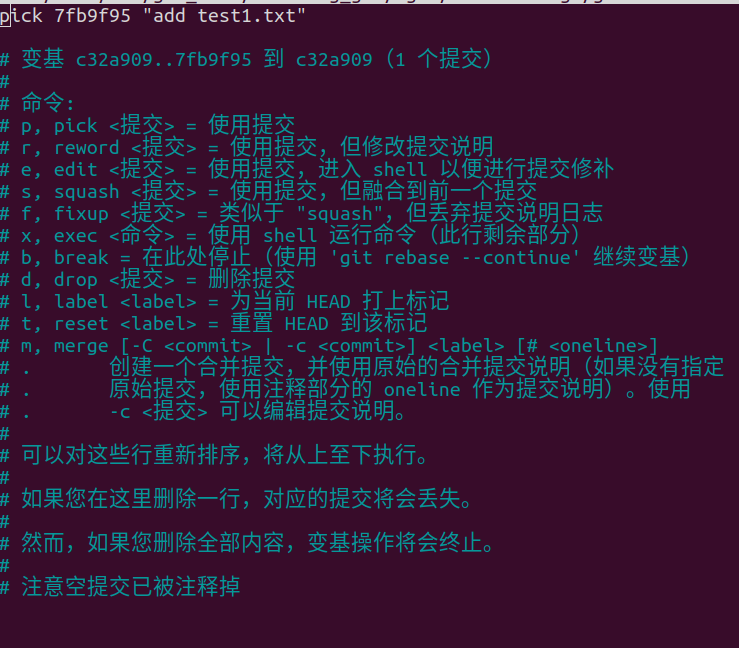

# GIT application

## 问题一

若你已经修改了部分文件、并且将其中的一部分加入了暂存区，应该如何回退这些修改，恢复到修改前最后一次提交的状态？给出至少两种不同的方式

- **方法一**

  使用 `git log` 获取上一次提交的哈希值

  再使用 `git reset --hard 哈希值` 将当前分支指向上一次提交

  ​	

- **方法二**

   使用 `git reset HEAD` 撤销暂存区的改动

​	再使用 `git checkout -- .` 恢复工作区到上一次提交的状态

​		

- **方法三**

  使用 `git revert` 回退版本

## 问题二

若你已经提交了一个新版本，需要回退该版本，应该如何操作？分别给出不修改历史或修改历史的至少两种不同的方式

**不修改历史记录**

- **方法一：**

  使用 `git revert 哈希值` ，创建一个新提交而不改变历史记录

   

- **方法二：**

  使用 `git checkout` 切换到之前的提交，但是会导致头指针处于分离状态

  

**修改历史记录**

- **方法一：**

  使用 `git reset --hard 哈希值` 将HEAD指向对应的哈希值，但会舍弃对应哈希值以后的修改

  

- **方法二：**

  使用`git rebase -i`HEAD~n ， 打开并编辑n个提交，若要删除提交，把前面的 pick 改成 drop 即可

  

  

​	

## 问题三

我们已经知道了合并分支可以使用 merge，但这不是唯一的方法，给出至少两种不同的合并分支的方式

- **方法一：**

  使用 `git cherry-pick 哈希值` 可将其他分支的提交合并到当前分支上，只需要其他分支提交的哈希值即可

  

- **方法二：**

​	使用 `git rebase 分支名`  将一个指定分支和并到当前分支上

