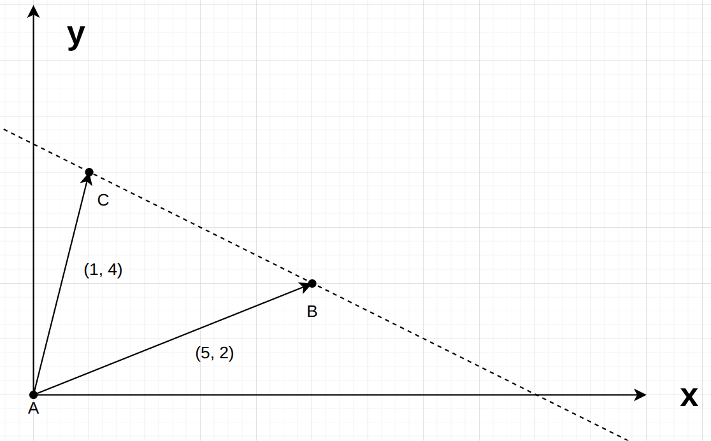
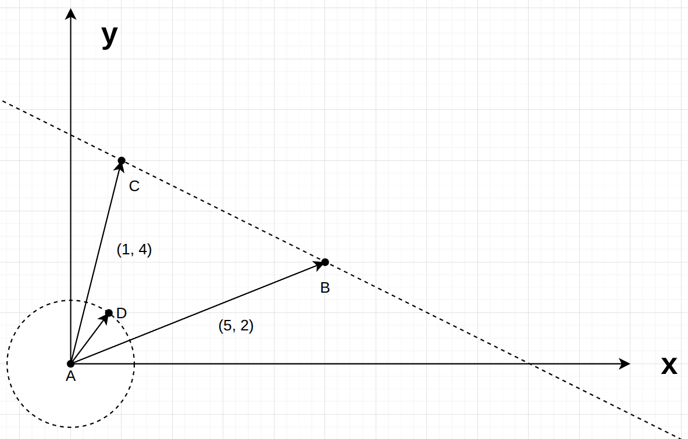

## 拉格朗日乘子法

### 举例和推导

不想看举例和推导的可以直接看后面的结论

- 一句话概括其思想：对于**带约束的求极值问题**，通过引入一个变量 $\lambda$，**将约束融合进函数里** 

先用来一个简单的例子：

ABC点已知，现引入一个D点，D在CB连成的直线上（约束），求 $\min|AD|^2$ 

令 $f = |AD|^2$ 

变成求 $\min f$ 

已知 D在CB连成的直线上，引入一个变量 $\alpha$ ，有
$$
AD = \alpha \cdot AC+(1-\alpha)\cdot AB
$$
化简得
$$
AD = (AC-AB)\cdot \alpha+AB
$$
将上式带入 $f = |AD|^2$ ，有
$$
\begin{aligned}
f(\alpha) &= |(AC-AB)\cdot \alpha+AB|^2 \\
&= [(AC-AB)\cdot \alpha+AB]^2 \\
&= (AC-AB)^2\cdot \alpha^2 + 2(AC-AB)AB\cdot \alpha +AB^2 \\
&= 20 \alpha^2-32\alpha+29
\end{aligned}
$$
$\frac{df(\alpha)}{d\alpha} = 0$ 时，解得 $\alpha = \frac45$，$f = 16.2$ 

---

问题不变，我们换一个思路

令点 $D$ 为 $(x, y)$ ，$f =|AD|^2= x^2+y^2 = r^2$ 

$r$ 为常数，此时函数 $f$ 为一个圆，目标是 $\min (x^2+y^2)$ 

有人会想，那我直接让半径为0不就是最小了？no，别忘了还有约束条件：

约束条件：D必须在直线CB上
$$
\begin{aligned}
AD &= (AC-AB)\cdot \alpha+AB \\
(x,y) &= (4\alpha+5, -2\alpha+2) \\
y &= -0.5x + 4.5
\end{aligned}
$$
问题就变成了：已知（约束条件） $y = -0.5x+4.5$ ，求 $\min (x^2+y^2)$ 

按照往常，直接将 $y = -0.5x+4.5$ 带入 $f = x^2+y^2$ 就好了。但这里，我们引入另一种方法

易得，当圆 $x^2+y^2 = r^2$ 与直线 $y = -0.5x+4.5$ **相切**时，有 $x^2+y^2$ 最小

令 $(x_0, y_0)$ 为切点，计算切点：

令
$$
f(x,y) = x^2+y^2 \\
g(x,y) = y+0.5x-4.5 = 0
$$
在切点处有
$$
\begin{cases}
\frac{d}{dx}[f(x_0, y_0)] = \frac{d}{dx}[g(x_0, y_0)] \\
g(x_0, y_0) = 0
\end{cases}
\tag{1}
$$
上式化简得
$$
-\frac{f_x(x_0, y_0)}{f_y(x_0, y_0)} = -\frac{g_x(x_0, y_0)}{g_y(x_0, y_0)}
$$
变换一下，并加入一个变量 $\lambda$ 
$$
-\frac{f_x(x_0, y_0)}{g_x(x_0, y_0)} = -\frac{f_y(x_0, y_0)}{g_y(x_0, y_0)} = \lambda
$$
在切点处的方程 (1) 变为
$$
\begin{cases}
f_x(x_0, y_0) + \lambda g_x(x_0, y_0) = 0 \\
f_y(x_0, y_0) + \lambda g_y(x_0, y_0) = 0 \\
g(x_0,y_0) = 0 \\
\tag{2}
\end{cases}
$$
三个方程，解三个未知量
$$
\begin{cases}
2x_0 + 0.5 \lambda  = 0 \\
2y_0 + \lambda = 0 \\
y_0+0.5x_0-4.5 = 0 \\

\end{cases}
$$
解得
$$
\begin{cases}
\lambda = -7.2\\
x_0 = 1.8\\
y_0 = 3.6\\
\end{cases}
$$

$$
\min(x^2+y^2) = 16.2
$$

将 (2) 写成更一般的形式，令 
$$
\mathcal{L}(x, y) = f(x, y) + \lambda \cdot y(x, y)
$$
便构建出求解拉格朗日乘子的方程组
$$
\begin{cases}
\mathcal{L}_x(x_0, y_0) = 0 \\
\mathcal{L}_y(x_0, y_0) = 0 \\
g(x_0,y_0) = 0 \\
\end{cases}
$$

- 拉格朗日乘子的核心在于：在极值点处，目标函数 f 的梯度 ∇f 与约束条件 gi 的梯度 ∇gi **平行**

---

### 结论

更一般的情况：

- 要寻找一个**一元或多元(n元)函数$f(x_1, x_2...,x_n)$的极值**，同时该函数**受到一个或者多个(m个)等式约束$g(x_1, x_2...,x_n)= 0$**时，可以引入拉格朗日乘子，将约束加入到函数中，求解该函数便能求解极值

问题：已知 $\sum_{j=1}^m g_j(x_1, x_2...,x_n)= 0$，求 $f(x_1, x_2...,x_n)$ 的极值

步骤：

1. 判断目标函数 $f$ 的凹凸性：

   如果是凹/凸函数，那么求出来的就是全局极小/大值；如果是非凸非凹函数，那么就能求出所有的局部极值点和鞍点

2. 构建拉格朗日函数
   $$
   \mathcal{L}(x_1, x_2...,x_n) = f(x_1, x_2...,x_n)+\sum_{j=1}^m \lambda_j \cdot g_j(x_1, x_2...,x_n)
   $$

3. 求解拉格朗日函数 (n个变量，m个约束)

$$
\begin{cases}
\frac{d\mathcal{L}}{dx_1} = 0 \\
\frac{d\mathcal{L}}{dx_2} = 0 \\
... \\
\frac{d\mathcal{L}}{dx_n} = 0 \\
g_1(x_1, x_2...,x_n)= 0 \\
g_2(x_1, x_2...,x_n)= 0 \\
...\\
g_m(x_1, x_2...,x_n)= 0 \\
\end{cases}
$$

解这个由 $n+m$ 个方程组成的非线性方程组，可以得到所有可能成为局部极值点的$ (x^∗,λ^∗) $驻点。

