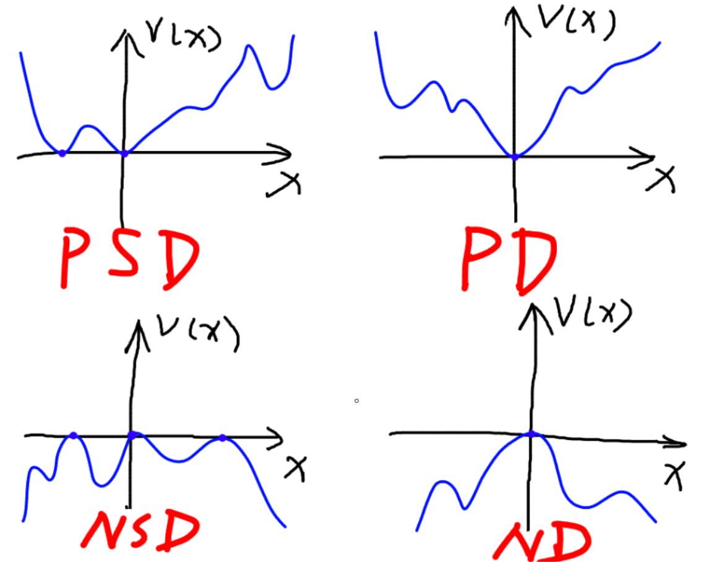
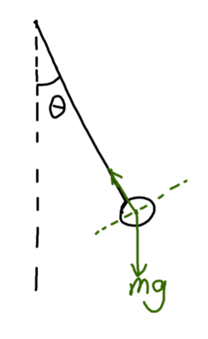

# 李雅普诺夫第二方法

（第六期讲过

- 基础概念：
  - PD：正定
  - PSD：半正定
  - ND：负定
  - NSD：半负定

- 数学定义：

$$
\begin{aligned}
PD: \\
&(1)\;\;\; V(0) = 0 \\
&(2)\;\;\; V(x) > 0,\; \forall x \in D- \{0\} \\
PSD: \\
&(1)\;\;\; V(0) = 0 \\
&(2)\;\;\; V(x) \geq 0,\; \forall x \in D- \{0\} \\
ND: \\
&(1)\;\;\; V(0) = 0 \\
&(2)\;\;\; V(x) < 0,\; \forall x \in D- \{0\} \\
NSD: \\
&(1)\;\;\; V(0) = 0 \\
&(2)\;\;\; V(x) \leq 0,\; \forall x \in D- \{0\} \\
\end{aligned}
$$

- 示例图：

## 李雅普诺夫稳定性判断：

回顾（class_6）：

 $V(x)$ 的定义：广义能量函数

1. 当且仅当 $x = 0$ 时，才有 $V(x) = 0$ 
2. 当且仅当 $x≠0$ 时，才有 $V(x)>0$ 

$\dot V(x)$ 的定义：$\dot V(x) = \frac{d}{dt}V(x) = \frac{\partial V(x)}{\partial x} \cdot \frac{dx}{dt}$ 

- 若 $x≠0$ ， 有 $\dot V(x) \le 0$ ，则称系统在李雅普诺夫意义下是稳定的
- 若 $x≠0$ ， 有 $\dot V(x)<0$ ，则系统是渐进稳定的 

换成前面讲的就是：

若：
$$
\begin{aligned}
&(1)\;\;\;V:PD \\
&(2)\;\;\;\dot V:NSD
\end{aligned}
\;\;
\Rightarrow
\;\;x=0 \;
\text{是稳定点}
$$
若
$$
\begin{aligned}
&(1)\;\;\;V:PD \\
&(2)\;\;\;\dot V:ND
\end{aligned}
\;\;
\Rightarrow
\;\;x=0 \;
\text{是渐进稳定点}
$$

**以上定理中稳定的结论是怎么得到的？**

​	基于微积分的一个最基本的结论之一：函数 $V(x)$ 是有下界的 (lower bounded)，并且函数的一阶导数是小于等于 0 ，那么该函数一定收敛于一个值。

​	$V(x)$ 正定，保证了 $V(x)$ 有下界0。加上 $\dot V(x)$ 是半负定的，就保证 $V(x)$ 会收敛到一个值，所以稳定。如果 $\dot V(x)$ 是负定的，就保证 $V(x)$ 一定收敛到它的下界0，又因为 $V(x)$ 是正定的【意味着只有在 $x=0$ 时，$V(x)$ 才等于0】，所以 $V(x)=0$ 一定推出 $ x=0$ ，也就是系统状态收敛到 0 ，所以系统渐近稳定。

---

### 如何求解李雅普诺夫函数 $V$ 及其导数 $\dot V$

例：

分析下列系统的李雅普诺夫稳定性
$$
\dot x_1 = ax_1 = f_1\\
\dot x_2 = bx_2 + \cos x_1 = f_2\\
$$
构造李雅普诺夫函数
$$
\begin{aligned}
V &= x_1^2 + x_2^2 \\

\dot V 
&= \frac{\partial V(x)}{\partial x} \cdot \frac{dx}{dt} \\
&= 2x_1\dot x_1 + 2x_2\dot x_2 \\
&= 2ax_1^2 + 2bx_2^2+2x_2\cos x_1 \\

\dot V &= 
\begin{bmatrix} \frac{\partial V}{\partial x_1} & \frac{\partial V}{\partial x_2}\end{bmatrix}
\begin{bmatrix} f_1 \\ f_2 \end{bmatrix}
= \nabla V \cdot f(x)
= L_fV(x) \\
\end{aligned}
$$

### 一个更具体的例子

一个单摆系统

（少了个杆长 L 忘记补上去了）

分析系统状态方程（最低点为 0 势能点）
$$
v = \dot \theta l \\
\mathcal{L} = L - V = \frac12m \dot \theta^2 l^2 - mgl(1-\cos\theta) \\ 
m \ddot \theta l^2 + mgl\sin \theta = 0 \\
\ddot \theta + \frac gl\sin \theta = 0
$$
设 $x_1 = \theta,\;x_2 = \dot \theta$ ，得到系统的状态方程
$$
\dot x_1 = x_2 \\
\dot x_2 = -\frac gl \sin x_1
$$
找 $V$ 函数

​	我们从能量入手，令
$$
V = T+V = \frac12m x_2^2 l^2 + mgl(1-\cos x_1)
$$
分析 $V$ ：

​	$x_1 = x_2 = 0$ 时，$V = 0$ 

​	$x_1 \neq 0,x_2 \neq 0$ 时，第一项和第二项显然大于0 ($V_1\in (-2\pi, 2\pi)$)， $V > 0$ 

​	所以 $V$ 是正定的

分析 $\dot V$ ：
$$
\dot V = \begin{bmatrix} \frac{\partial V}{\partial x_1} & \frac{\partial V}{\partial x_2}\end{bmatrix}
\begin{bmatrix} \dot x_1 \\ \dot x_2\end{bmatrix}
= mglx_2\sin x_1 - mglx_2 \sin x_1 = 0
$$
​	所以 $\dot V$ 是半负定的	这个系统是稳定的

结论：**这个系统是稳定的**

从结果可以看出来，即使 $x_1,x_2$ 是有界的，也不代表 $x_1,x_2\rightarrow 0$ 

---

### 上面的例子加上摩擦

系统变为
$$
m \ddot \theta l^2 + mgl\sin \theta +kl\dot \theta= 0 \\
\ddot \theta + \frac gl\sin \theta +\frac{k}{ml}\dot \theta= 0 \\
$$

- 考虑上了和速度成正相关的摩擦力

$$
\dot x_1 = x_2 \\
\dot x_2 = -\frac gl\sin x_1 - \frac{k}{ml}x_2 \\
$$

找 $V$ 函数

​	我们从能量入手，令
$$
V = T+V = \frac12m x_2^2 l^2 + mgl(1-\cos x_1)
$$
分析 $V$ ：

​	$x_1 = x_2 = 0$ 时，$V = 0$ 

​	$x_1 \neq 0,x_2 \neq 0$ 时，第一项和第二项显然大于0 ($x_2\in (-2\pi, 2\pi)$)， $V > 0$ 

​	所以 $V$ 是正定的

分析 $\dot V$ ：
$$
\dot V = \begin{bmatrix} \frac{\partial V}{\partial x_1} & \frac{\partial V}{\partial x_2}\end{bmatrix}
\begin{bmatrix} \dot x_1 \\ \dot x_2\end{bmatrix}
= 
-lkx_2^2
$$
​	显然，只要 $x_2 = 0$ ，无论 $x_1$ 怎么取值，都有 $\dot V = 0$ ，所以 $\dot V$ 是半负定的

但是，从物理常识来说，带摩擦的单摆，最终会停下来，但是上面的数学结果却不是渐进稳定的。

下一期视频会对这个进行进一步讨论

