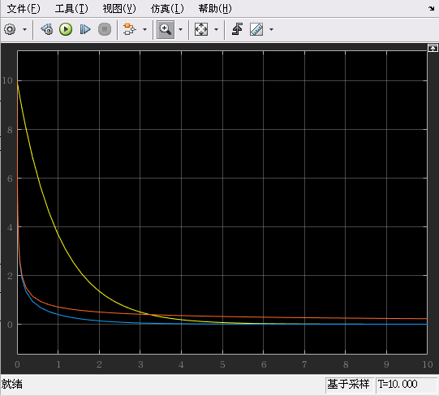
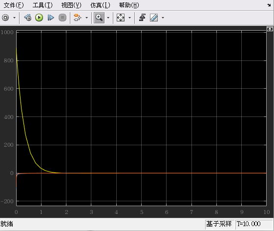

# 反馈系统线性化

考虑一个正常的系统
$$
\dot x = f(x, u) \\
$$
我们假设 $u$ 是关于 $x$ 的函数 $u = \phi(x)$ 
$$
\boxed{
\dot x = f(x, \phi(x))
}
$$
以上方程就是我们的研究对象

## 例1.

$$
\dot x = ax^2 + u \\
$$

这个系统的平衡点是原点 $f(0, 0) = 0$ ，我们希望这个点是渐进稳定平衡点

直觉告诉我们，可以令 $u = -ax^2 - x$ ，这样就把系统中的非线性项去掉了，带入得
$$
\dot x = -x
$$
分析 $u = -ax^2 - x$ ：其中 $-ax^2$ 消除了非线性项，$-x$ 为系统带来了稳定

>
>
>观察这个反馈系统线性化的方法
>
>1.  $a$ 必须知道
>2. 这个方法很直接，简单粗暴，**但不一定是最佳的方法** 
>
>

## 例2.

$$
\dot x = x^2 - x^3 + u \\
$$

按照 例1 的想法，我们可以令 $u_1 = -x^2 + x^3 - x$ 

是否有其他方法呢？其实还可以使用李雅普诺夫方法来解决

>
>
>回忆李雅普诺夫
>
> $V(x)$ 的定义：广义能量函数
>
>1. 当且仅当 $x = 0$ 时，才有 $V(x) = 0$ 
>2. 当且仅当 $x≠0$ 时，才有 $V(x)>0$ 
>
>$\dot V(x)$ 的定义：$\dot V(x) = \frac{d}{dt}V(x) = \frac{\partial V(x)}{\partial x} \cdot \frac{dx}{dt}$ 
>
>- 若 $x≠0$ ， 有 $\dot V(x) \le 0$ ，则称系统在李雅普诺夫意义下是稳定的
>- 若 $x≠0$ ， 有 $\dot V(x)<0$ ，则系统是渐进稳定的 
>
>

先令 $V = \frac12x^2$ ，可得$V$ 是正定的

计算可得 $\dot V = x(x^2 - x^3 + u) = x^3 - x^4 + xu$  

如果我们希望系统渐进稳定，应该让 $\dot V < 0$ 。所以我们设计的 $u$，应该尽量消去 $\dot V$ 中的奇次项，保留 $\dot V$ 中的偶次项

我们令 $u_2 = -x^2-x \;\Rightarrow\;\dot V = -x^4-x^2 \;\Rightarrow\; \dot V \text{ is ND}$ 

或者令 $u_3 = -x^2 \;\Rightarrow\;\dot V = -x^4 \;\Rightarrow\; \dot V \text{ is ND}$ 

### 仿真

我们使用matlab来看看，不同的 $u$ 效果怎么样

黄、蓝、橙线分别代表 $u_1, u_2,u_3$ ，图一是状态 $x$ 的变化，图二是输入 $u$ 的变化

分析：

- $u_1$ 虽然能收敛，但是一开始的输入非常大

- $u_2$ 最好，收敛速度快，输入也不会太大

- $ u_3$ 虽然输入不大，但是收敛非常慢

