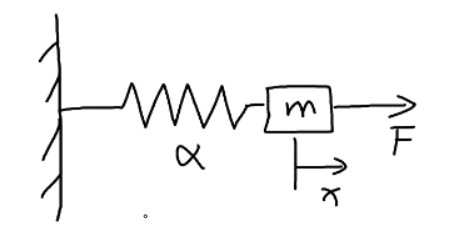

# 非线性系统反馈线性化控制

考虑一个简单的系统

对该系统建模
$$
m\ddot x + \alpha x^3 = F
$$
明显，这是一个非线性系统

**目标：改变F，使得滑块按指定的轨迹进行移动** 

建立系统状态方程：令 $u = F;\;x_1 = x;\;x_2 = \dot x$ 
$$
\dot x_1 &= x_2 \\ \tag 1
$$

$$
\dot x_2 = -\frac{\alpha}{m}x_1^3 + \frac 1m u \tag 2
$$

目标 $x_1 \rightarrow x_{1d}$ （d：Desired）

观察 (1)(2) ，我们通过改变 $u$ ，来控制 $x_2$ ，$x_2 $又可以反向控制 $x_1$ ，我们把这种系统叫做**链式系统** (chain of integrator)

引入 $e:\text{errow}$
$$
e = x_{1d}-x_1 \tag 3
$$
此时我们的目标发生了改变，现在我们要让 $e \rightarrow 0$ 

对 $e$ 求导，得到 $e$ 随时间的变化
$$
\dot e = \dot x_{1d} - \dot x_1
$$
(1) 带入上式
$$
\dot e = \dot x_{1d} - x_2 \tag 4
$$

> 为了能让 $e \rightarrow 0$ ，我们可以找一个李雅普诺夫函数，满足
> $$
> V(e):\text{PD} \\
> \dot V(e):\text{ND} \\
> $$
> 最后就能得出系统渐进稳定，即 $e \rightarrow 0$ 的结论

设
$$
V_1 = \frac12e^2 \\ \tag 5
$$
显然 $V_1$ 是正定的

计算 $\dot V_1$ ，同时 (4) 带入
$$
\dot V_1 = \frac{\partial V_1}{\partial e}\cdot\frac{d e}{d t} = e\dot e
= e(\dot x_{1d} - x_2) 
\tag 6
$$
为了能让 $\dot V_1$ 是负定的，我们可以设计令 $(\dot x_{1d} - x_2 \tag 4) = -k_1 e$ ，其中 $k_1 > 0$ （我们称 $k_1$ 为controller gain），这样就能使 $\dot V_1$ 是负定的 ( $\dot V_1 = -k_1e^2$ )

 那如何来实现 $(\dot x_{1d} - x_2 \tag 4) = -k_1 e$ 呢？
$$
x_{2d} = \dot x_{1d} + k_1e \tag 7
$$
其中，$x_{2d}$ 就是 $x_2$ 的期望值，当 $x_2 = x_{2d}$ 时，就应该使 $\dot V_1 = -k_1e^2$ 

现在我们的目标就是令 $x_2 \rightarrow x_{2d}$ ，我们再引入一个误差函数
$$
\delta = x_{2d} - x_2 \tag 8
$$
把 (8) 带入到 (6) 中，得
$$
\dot V_1 = e(\dot x_{1d} - x_{2d} + \delta)
$$
(7) 带入上式
$$
\dot V_1 = e(- k_1e  + \delta) = -ke^2 + e \delta \tag 9
$$
现在我们来分析一下 $\delta$ 的变化，对 (8) 两边求导 
$$
\dot \delta = \dot x_{2d} - \dot x_2
$$
(2)(7) 带入上式
$$
\dot \delta = \ddot x_{1d} + k_1\dot e +\frac{\alpha}{m}x_1^3 - \frac 1m u
$$
(4) 带入上式
$$
\dot \delta = \ddot x_{1d} + k_1(\dot x_{1d} - x_2 ) +\frac{\alpha}{m}x_1^3 - \frac 1m u 
\tag {10}
$$
现在我们的新目标是令 $e\rightarrow 0;\;\delta\rightarrow 0$

也就是说，我们要找到一个新的李雅普诺夫函数 $V(e, \delta)$ ，同时满足
$$
V(e, \delta) :\text{PD} \\
\dot V(e, \delta) :\text{ND} \\
$$
我们构建一个这样的李雅普诺夫函数
$$
V_2 = V_1 + \frac12\delta^2 = \frac12(e^2+\delta^2)
$$
对 $V_2$ 求导
$$
\dot V_2 = \dot V_1 + \delta\dot\delta
$$
(9) 带入上式
$$
\dot V_2 = -k_1e^2 + e \delta + \delta\dot\delta = -k_1e^2 + \delta(e+\dot\delta)
$$
我们分析 $\dot V_2 $ 这个式子

$-k_1e^2$ 这一项肯定是负定的，同时我们也希望 $\delta(e+\dot\delta)$ 也是负定的

我们设计：$(e+\dot\delta) = -k_2\delta$ ，（$k_2>0$）

我们把 (10) 带入设计的式子
$$
e+\ddot x_{1d} + k_1(\dot x_{1d} - x_2 ) +\frac{\alpha}{m}x_1^3 - \frac 1m u  = -k_2\delta
$$
最后能推出来
$$
\boxed{
u = me+ m\ddot x_{1d} + mk_1(\dot x_{1d} - x_2 ) +\alpha x_1^3 + mk_2\delta 
}\tag {11}
$$
这就是我们想要的输出表达形式

- 验证

(8) 带入 (4)
$$
\dot e = \dot x_{1d} - (x_{2d} - \delta)
$$
(7) 带入上式
$$
\dot e =  - k_1e + \delta
$$
(11) 带回 (10)
$$
\begin{aligned}
\dot \delta &= \ddot x_{1d} + k_1(\dot x_{1d} - x_2 ) +\frac{\alpha}{m}x_1^3 - \frac 1m (me+ m\ddot x_{1d} + mk_1(\dot x_{1d} - x_2 ) +\alpha x_1^3 + mk_2\delta ) \\
&= -e - k_2\delta
\end{aligned}
$$
写在一起得
$$
\begin{bmatrix}
\dot e \\
\dot \delta \\
\end{bmatrix} =

\begin{bmatrix}
-k_1 & 1 \\
-1 & -k_2 \\
\end{bmatrix}
\begin{bmatrix}
e \\
\delta \\
\end{bmatrix}
$$
整个过程称为 Feedback Linearization ，即反馈系统线性化

分析这个系统的特征值
$$
\lambda_1 + \lambda_2 = -k_1-k_2 <0 \\
\lambda_1 \cdot \lambda_2 = k_1k_2+1 > 0 \\
$$
显然 $\lambda_1,\lambda_2$ 同号，都小于 0

平衡点为 $\begin{bmatrix}e \\\delta \\\end{bmatrix} = 0$ ，所以系统是一个**渐进稳定的系统**
