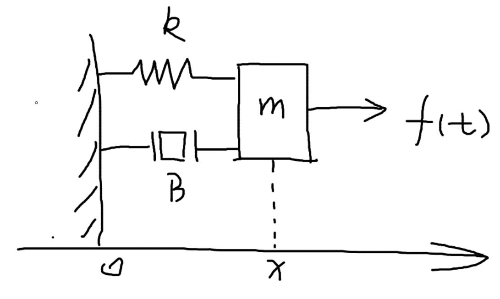

## 状态空间表达：

对于这个 质量-弹簧-阻尼 系统

- 输入：$u(t) = f(t)$ 
- 输出：$x$ 

受力分析得：
$$
f(t)  = m\ddot{x} + B\dot{x} + Kx
\tag{1}
$$
在**经典控制理论**中，常用拉普拉斯变换，找到系统的**传递方程**

- 对两端进行拉普拉斯变换得

$$
F(s) = ms^2X(s) +BsX(s) + KX(s)
$$

- 传递函数（输出除以输入）得

$$
G(s) = \frac{X(s)}{F(s)} = \frac{1}{ms^2+Bs+K}
$$

在**现代控制理论**中，常用状态空间来表示系统

- 状态空间可以想象成一个集合，包含**系统的输入、输出、状态变量**，然后用一个**一阶微分方程**来表达出来

$$
f(t)  = m\ddot{x} + B\dot{x} + Kx \\
$$

- 构建状态空间方程要先选择状态变量，并消除高阶项

$$
z_1 = x, \,\,z_2 = \dot{x}
$$

带入得
$$
\dot{z_2} = \frac{1}{m}(f - Bz_2 - Kz_1)
$$
写成矩阵的形式就是
$$
\begin{bmatrix}
\dot{z_1} \\
\dot{z_2}
\end{bmatrix}
=
\begin{bmatrix}
0 & 0\\
-K/m & -B/m
\end{bmatrix}

\begin{bmatrix}
z_1 \\
z_2
\end{bmatrix}
+
\begin{bmatrix}
0\\
1/m
\end{bmatrix}
\begin{bmatrix}
u(t)
\end{bmatrix}
$$
上面就是状态方程

而系统的输出方程则是由 $z_1 = x$ 得：
$$
y 
= 
x
=
\begin{bmatrix}
1 & 0\\
\end{bmatrix}
\begin{bmatrix}
z_1 \\
z_2
\end{bmatrix}
+
\begin{bmatrix}
0 
\end{bmatrix}
\begin{bmatrix}
u(t)
\end{bmatrix}
$$
写成一般形式就是
$$
\dot{z} = A z+Bu \\
y = Cz+ Du
\tag{2}
$$
上面就是**状态空间表达式**

### 系统传递函数和状态空间表达的关系

对(2)两边进行拉普拉斯变换
$$
sZ(s) = AZ(s) + BU(s) \\
Y(s) = CZ(s) + DU(s)
$$
化简得
$$
Y(s) = [C(sI - A)^{-1}B + D]U(s)
$$
根据传递函数的定义
$$
G(s) = \frac{Y(s)}{U(s)} =  C(sI - A)^{-1}B +D
$$

- 如果有 $|sI - A| = 0$ ，那么 $s$ 就是 $A$ 矩阵的特征值。传递函数的分母等于0的解，求出的解就是其极点，极点将会决定系统的稳定性，所以合理猜测 $A$ 矩阵的特征值也可能决定系统的稳定性

