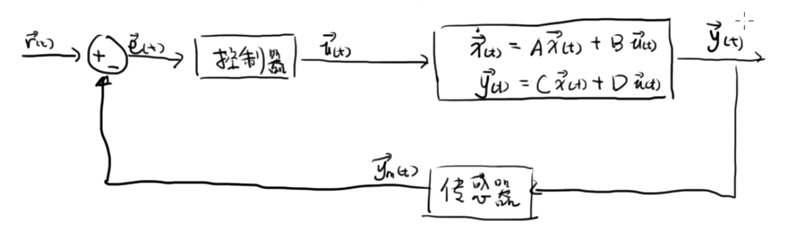
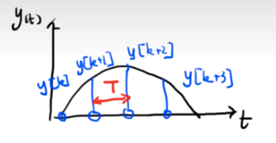
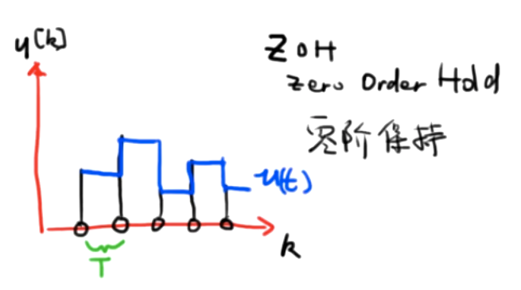
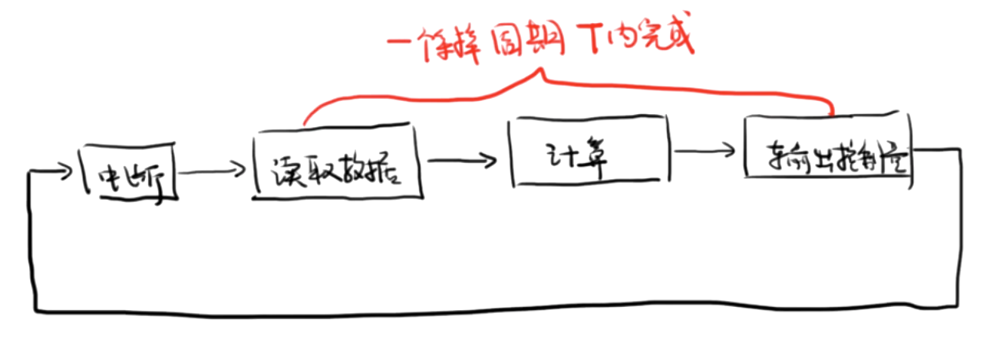

## 连续时间系统 (*Continuous time system*) 

定义：系统在一段连续时间 $t$ 内的变化

经典的连续时间闭环反馈系统

## 离散时间系统 (Discrete time system)

- 数字控制器就是一种离散的时间系统，因为在计算机控制中，没有时间的概念
- 复杂的连续系统难以得到解析解，所以会将连续系统离散化，用离散的方式求数值解

## 连续与离散之间的转换

### 采样周期（连续到离散）

$T$：采样周期 Sampling Time

$\frac 1 T$：采样频率 Sampling Frequency

### 采样周期选取

采样周期过小，内存压力较大

采样周期过大，产生混叠，难以还原信号

- 采样原理：**采样频率至少要为被采信号最高频率的两倍才可以重建出原信号**

  一般来说，采样原理只是下限值，采样频率往往会选择最高频率的五倍到十倍

### 离散到连续

对于数字控制器来说，其信号是离散的 $u(k)$ ，很难直接转换到系统中。所以引入一个保持器，常用零阶保持，即控制系统的输入在一个周期内保持不变

---

### 实时控制系统

对于一个实时控制器，一个计算周期应该在一个采样周期 $T$ 内完成

## 系统状态方程的转换

系统状态方程 $\dot{x}(t) = Ax(t)+Bu(t)$ 的解为
$$
\vec{x}(t) = e^{A(t-t_0)}\vec{x}(t_0)  + \int_{t_0}^t B e^{A(t-\tau)} \vec u(\tau)d\tau \\
$$
对于一个实时控制器，连续与离散的变换为
$$
u(t) = u(kT)
$$
带入得
$$
x[k+1] =  e^{AT}{x}[k]  + \int_{0}^{T} B e^{AT} d\tau \cdot u[k]\\
$$
最后写成
$$
\boxed{
\vec x[k+1] = F\vec {x}[k]  +G\vec u[k]\\
}
$$
其中
$$
F = e^{AT} \\
G =  \int_{0}^{T} B e^{AT} d\tau 
$$
