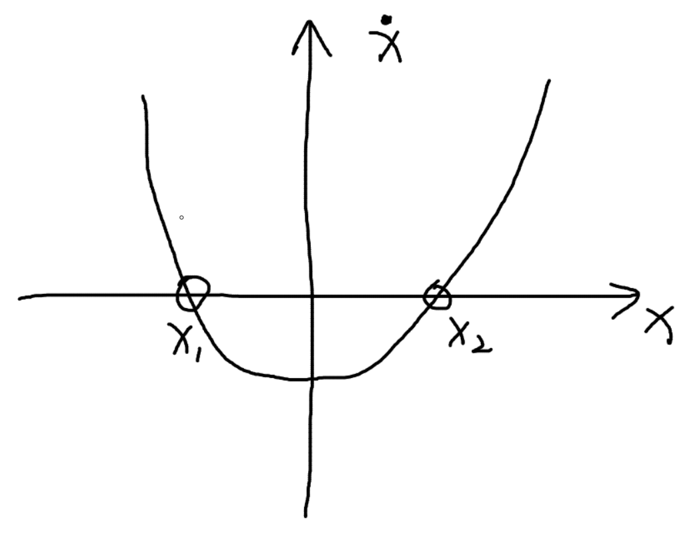
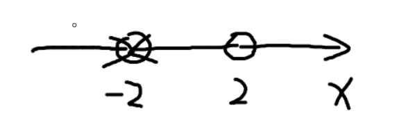
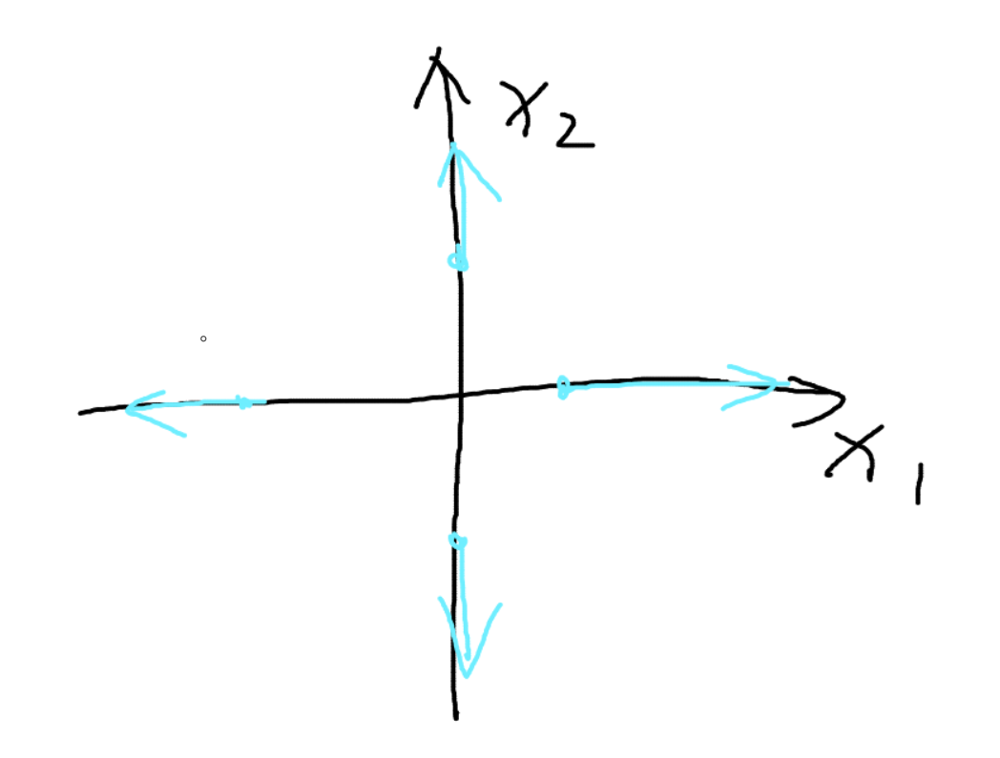
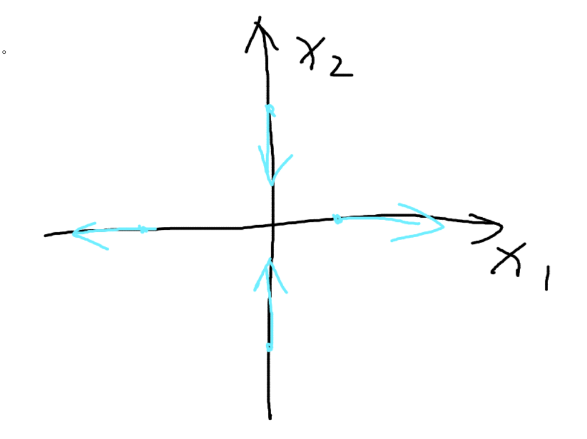
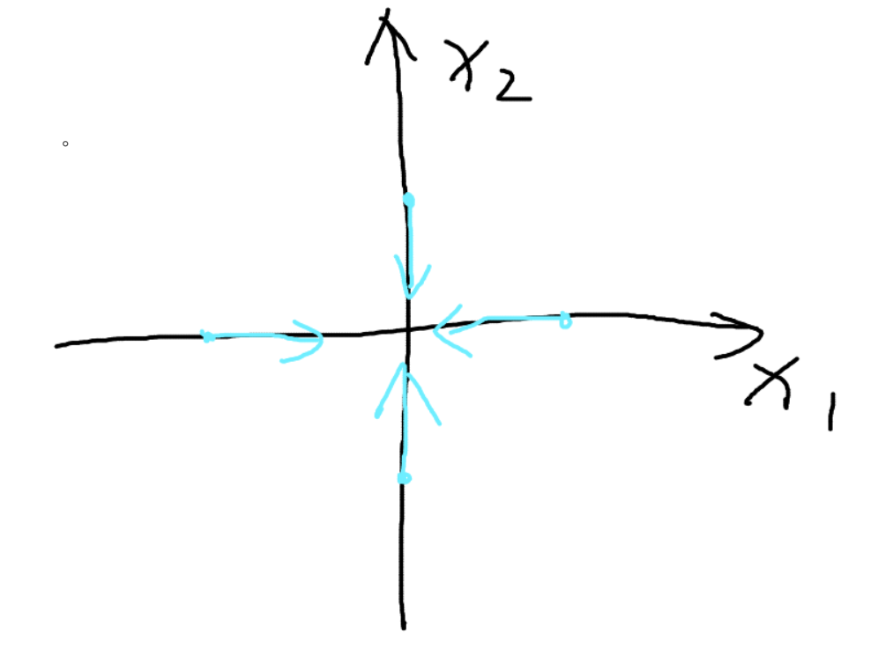
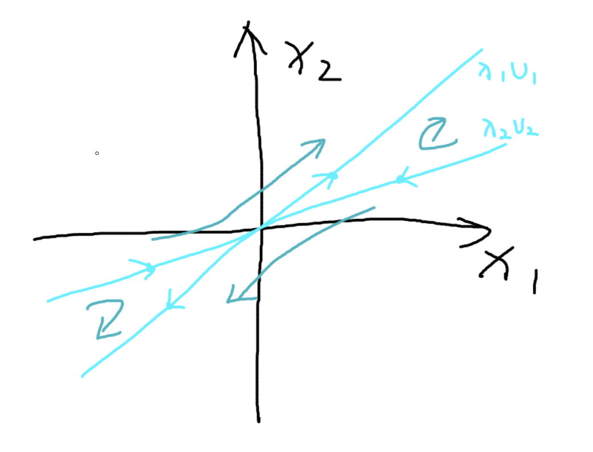

## 相图、相轨迹

- 目的：通过分析微分方程的相图，来直观地分析系统的稳定性

### 一维系统

现在来考虑一个经典的一维系统 $\dot{x} = f(x)$ 

令 $f(x) = x^2-4$ 

易得， $x<-2, x>2$ 时，$\dot{x} > 0$ ； $ -2<x<2$ 时，$\dot{x} < 0$  

其对应的一维相图为

当 $\dot{x} = 0$ 时，$x_{1} = -2 ,\,x_2 = 2$ ，我们称 $x_{1},\,x_2 $ 为平衡点（Fixed Point / Equilibrium Point）。如果起始点在 $x_{1}$ 或 $x_2 $ ，$x$ 将不会变化。

现在我们分析这两个平衡点

- 对于 $x_1$ 点来说，其两侧的点都会往靠近 $x_1$ 点移动，所以称 $x_1$ 点为稳定点(stable point)
- 对于 $x_2$ 点来说，其两侧的点都会往远离 $x_2$ 点移动，所以称 $x_2$ 点为不稳定点(unstable point)

 可以看出来，**可以用 $\dot{x}$ 的符号来判断 $x$ 的变化趋势，从而判断平衡点的性质**

---

### 二维系统

对于一个二维系统
$$
\begin{bmatrix}
\dot{x}_1 \\
\dot{x}_2 \\
\end{bmatrix}
 = 
\begin{bmatrix}
a & b\\
c & d \\
\end{bmatrix}
\begin{bmatrix}
x_1 \\
x_2 \\
\end{bmatrix}
$$
现在先分析简单一点的情况，令 $b=c=0$ ，有
$$
\dot{x}_1 = ax_1 \\
\dot{x}_2 = dx_2 \\
$$
对于一个二维系统，$\dot{x}_1 = 0,\dot{x}_2 = 0$ 时，对应的 $x_1,x_2$ 为平衡点

易得，上述方程的平衡点为 $x_1 = 0, x_2 = 0$ 

现在我们来分析其平衡点的性质。

对于上述方程，我们可以通过分析不同 $a, d$ 的取值，来分析 $\dot x$ 的符号，进一步分析平衡点的性质

1.  $a = d > 0$   source point(unstable)

   可得：

   $x_1>0$ 时 $\dot x_1 > 0$ ； $x_1<0$ 时 $\dot x_1 < 0$ ；

   $x_2>0$ 时 $\dot x_2 > 0$ ； $x_2<0$ 时 $\dot x_2 < 0$ ；

   

   绘制出流图：

   

   所以这个平衡点是发散的，是一个不稳定点(unstable point)

2. $a > d > 0$ 

   和上面一种差不多，只是注意a和d关系变化导致的流图变化，这里直接给出流图

   

3. $a>0, \,d<0$   saddle point (unstable)

   

   

4. $a<0, \,d<0$   sink point (stable)

   
   

---

现在考虑更一般的形式来的分析平衡点性质，对于一个二维系统
$$
\begin{bmatrix}
\dot{x}_1 \\
\dot{x}_2 \\
\end{bmatrix}
 = 
\begin{bmatrix}
a & b\\
c & d \\
\end{bmatrix}
\begin{bmatrix}
x_1 \\
x_2 \\
\end{bmatrix}
$$
可以写成 $\dot x = Ax$ 

令 $x = Py$ ，$P$ 为 $x$ 的特征向量组成的矩阵

有 $\dot y = \Lambda y$ ，$\Lambda$ 为对角矩阵，元素都是矩阵 $A$ 的特征值

这部分的推导可以看这个视频：[DR_CAN讲特征值和特征向量(bilibili)](https://www.bilibili.com/video/BV1fx41137Zm?spm_id_from=333.788.videopod.sections&vd_source=fa702e26771092fb8707df94a1159b02) 

- 现在举一个具体的例子来计算：

$$
\dot x =
\begin{bmatrix}
-3 & 4\\
-2 & 3 \\
\end{bmatrix}
x
\tag{1}
$$

计算矩阵A的特征值
$$
\begin{aligned}
\begin{vmatrix}
\lambda I - A
\end{vmatrix} &= 0 \\

\begin{vmatrix}
\lambda+3 & -4\\
2 & \lambda-3 \\
\end{vmatrix} &= 0 \\

\lambda^2 &=1 \\
\lambda &= \pm1 \\

\Downarrow \\

\Lambda &= 
\begin{bmatrix}
1 & 0 \\
0 &-1 \\
\end{bmatrix} \\

\end{aligned}
$$
计算特征向量
$$
\begin{aligned}
\begin{bmatrix}
\lambda I - A
\end{bmatrix} v&= 0 \\ 

\begin{bmatrix}
\lambda+3 & -4\\
2 & \lambda-3 \\
\end{bmatrix}
\begin{bmatrix}
u_1\\
u_2\\
\end{bmatrix}
&=0 \\

\Downarrow \\

\lambda_1 = 1, 
v_1 &= 
\begin{bmatrix}
1\\
1\\
\end{bmatrix} \\

\lambda_2 = -1, 
v_2 &= 
\begin{bmatrix}
2\\
1\\
\end{bmatrix} \\

\Downarrow \\

P = 
\begin{bmatrix}
v_1 & v_2\\
\end{bmatrix}
&=
\begin{bmatrix}
1&2\\
1&1\\
\end{bmatrix}

\end{aligned}
$$
将 $v_1, v_2$ 分别带入(1) 的 $x$ 中，根据特征向量的性质，有 $\dot x = \lambda_1 v_1， \dot x = \lambda_2 v_2$ ，绘制出流图

这里的箭头理解为，在对应的点 $(x_1, x_2)$ 处的梯度，大小及方向就是对应的 $(\dot x_1, \dot x_2)$ 。由于矩阵的特征向量方向上，矩阵左乘特征向量的结果方向不变，所以此时梯度 $(\dot x_1, \dot x_2)$ 和对应的向量 $(x_1, x_2)$ 方向相同。

现在来分析  $\dot y = \Lambda y$ ：
$$
\dot y = 
\Lambda y = 
\begin{bmatrix}
1 & 0 \\
0 &-1 \\
\end{bmatrix} 
y
\\
$$
根据前面推导的简单的二维系统的相图，可知此时 $y$ 的平衡点就是 saddle point (unstable) 

而前面的决定平衡点性质的 $a, \,d$ 就对应着现在的 $\lambda_1, \,\lambda_2$ ，也就是说，$\lambda_1, \,\lambda_2$ 决定着 $y$ 的平衡点的性质

可以发现，$x$ 与 $y$  平衡点性质相同，所以，**我们可以直接使用 $\lambda_1, \,\lambda_2$ 来判断系统的稳定性** 

---

现在回到经典控制理论中，我们之前推导了 $G(s) = C(sI-A)^{-1}B+D$ 

在经典控制理论中，$|sI -A| = 0$ 的解 $s = \lambda_i $ 就是系统的**特征值**，等于系统传递函数的极点，传递函数的极点又决定了系统的稳定性。所以，状态空间方程的特征值将决定系统的稳定性

---

现在考虑状态转移矩阵更复杂一点的情况
$$
\dot x =
\begin{bmatrix}
0 & a \\
-a & 0 \\
\end{bmatrix} 
x
$$
解出来
$$
\lambda = \pm ai \\
v_1 =
\begin{bmatrix}
1 \\
a_i\\
\end{bmatrix} , 
v_2 = 
\begin{bmatrix}
1 \\
-a_i\\
\end{bmatrix}
$$
已知
$$
\dot y = \Lambda y \\
x= py
$$
有
$$
\dot y =
\begin{bmatrix}
ai & 0  \\
0 & -ai \\
\end{bmatrix} 
y \\
$$
根据线性微分方程的解，得
$$
y_1 = C_1e^{ait}, \,y_2 = C_2e^{-ait} \\
x = 
\begin{bmatrix}
1 & 1  \\
ai & -ai \\
\end{bmatrix} 
\begin{bmatrix}
C_1e^{ait}  \\
C_2e^{-ait} \\
\end{bmatrix} \\ \\
x_1 = C_1e^{ait} + C_2e^{-ait} \\
x_2 = aiC_1e^{ait} - aiC_2e^{-ait} \\
$$
使用泰勒展开 $e^{ait} = \cos at + i\sin at$ 
$$
x_1 = C_1( \cos at + i\sin at) + C_2(\cos at - i\sin at)  = (C_1 + C_2)\cos at + (C_1 - C_2)i\sin at\\
x_2 = aiC_1( \cos at + i\sin at) - aiC_2( \cos at + i\sin at) = (aC_1-aC_2)i\cos at + (-aC_1 + aC_2)\sin at \\
$$
简化一下常数
$$
x_1 = B_1\cos at + B_2i\sin at\\
x_2 = B_3i\cos at + B_4\sin at \\
$$
取实部部分
$$
x_1 = B_1\cos at \\
x_2 = B_4\sin at \\
$$
所以有
$$
(\frac{x_1}{B_1})^2 + (\frac{x_2}{B_4})^2 = 1
$$
这是一个椭圆，取椭圆上与坐标轴相交的一点，便可得椭圆的方向，也就能画出其相图

- 我们把这种平衡点叫做 center point 

> 如果线性微分方程的解是由两个项相加而成，这样的话，每一个项单独拿出来，都是微分方程的解。 
>
> 比如说：$dx/dt=2x$. 解可以是 $x=e^2t+2e^2t$. 而这其中 $x=e^2t $ 和 $x=2e^2t$ 也都是解。
>
> 所以对于这个问题， 这两个项相加，只需要分析他的实部部分。这其实也是线性系统的一个特性。

---

现在考虑状态转移矩阵再复杂一点的情况
$$
\dot x =
\begin{bmatrix}
1 & -2 \\
2 & 1 \\
\end{bmatrix} 
x
$$
就不推导了，最后算出来的特征值为
$$
\lambda = 1 \pm 2i
$$
对应的相图

是一个螺旋向外的图

## 总结

对于一个二维的系统，其特征值和平衡点的关系

| $\lambda _1, \lambda_2$ 的范围                               | 相图性质 | 平衡点性质                          |
| ------------------------------------------------------------ | -------- | ----------------------------------- |
| $\lambda_1 < 0, \lambda_2 < 0$                               | 聚集     | 稳定 (stable point)                 |
| $\lambda_1 > 0, \lambda_2 < 0$   or   $\lambda_1 < 0, \lambda_2 > 0$ | 鞍形     | 不稳定 (saddle point)               |
| $\lambda_1 < 0, \lambda_2 < 0$                               | 发散     | 不稳定 (unstable point)             |
| $\lambda = a \pm b,\,\,a = 0$                                | 椭圆     | 稳定，但并非渐近稳定 (center point) |
| $\lambda = a \pm b,\,\,a > 0$                                | 螺旋向外 | 不稳定 (unstable point)             |
| $\lambda = a \pm b,\,\,a < 0$                                | 螺旋向内 | 稳定 (stable point)                 |

