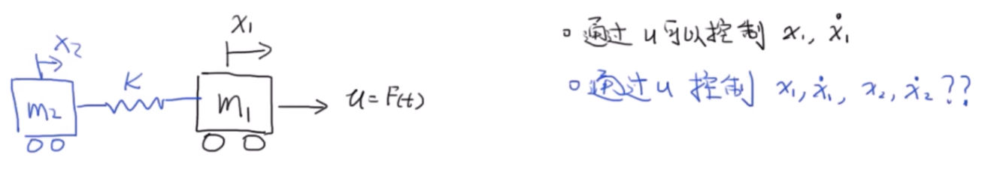
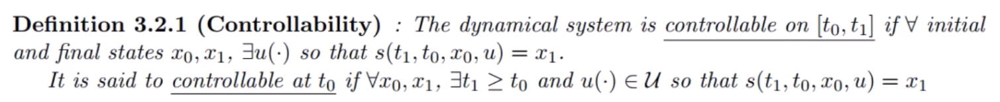

# 系统的可控性

- 背景：线性时不变系统的稳定性

来看这样一个问题：

两小车，状态变量为 $x_1, x_2,\dot x_1, \dot x_2$ ，系统输入为外力 $F$ ，能否通过控制系统输入来控制状态？

- 先来看一下系统可控性的定义：

已知系统的状态方程为 $\dot x = Ax+Bu$ ，$t_0, t_1$ 时刻的状态分别为 $x_0,x_1$ ，将存在一个输入 $u$ ，在有限的时间里可以把 $x_0$ 的状态变成 $x_1$ 的状态

- 可控性判断的推导

离散系统

$$
x_{k+1} = Ax_k+Bu_k
$$

令 $x_0 = 0$ ，随着时间的推移，有

$$
\begin{aligned}
x_1 &= Bu_0 \\
x_2 &= ABu_0 + Bu_1 \\
x_3 &= A^2Bu_0 + ABu_1 + Bu_2 \\
&...\\
x_n &= A^{n-1} Bu_0 +A^{n-2}Bu_1 +...+Bu_{n-1}
\end{aligned}
$$

写成矩阵就是

$$
\begin{bmatrix}
x_1 \\
x_2 \\
...\\
x_n \\
\end{bmatrix}
= 
\begin{bmatrix}
B & 0 & ... & 0 \\
AB & B &... &0 \\
...& & &...\\
A^{n-1}B & A^{n-2}B & ... & B
\end{bmatrix}

\begin{bmatrix}
u_0 \\
u_1 \\
...\\
u_{n-1} \\
\end{bmatrix}
$$
提取出最后一个状态
$$
x_n =

\begin{bmatrix}
B & ... & A^{n-2}B & A^{n-1}B \\
\end{bmatrix}

\begin{bmatrix}
u_{n-1} \\
...\\
u_1 \\
u_0 \\
\end{bmatrix} \\

A \in R^{n\times n} ,\,\,
B \in R^{n\times r} ,\,\,
C_o 
= 
\begin{bmatrix}
B & ... & A^{n-2}B & A^{n-1}B \\
\end{bmatrix}  \\
C_o \in R^{n\times nr} ,\,\,
$$

**根据系统可控性的定义可知，如果系统可控，则方程应该有解。根据线性代数秩的定义，上述式子若有解，则他的秩必须为 $n$ 。即**
$$
Rank(C_o) = n
$$

对于连续系统同理

注意

1. 这里的可控性是指点对点的可控，而不是轨迹的可控。即可以控制系统从状态 $x_0$ 变到 $x_n$ ，但是**中间的状态的变化不一定可控**
2. 可控指理论可控，**现实系统需考虑物理约束**

---

