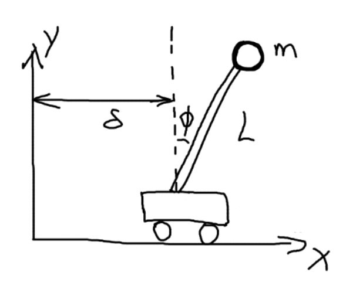

# 线性控制器设计 （Linear Controller Design）

- 开环系统系统（open loop）：$\dot x = Ax$ 

- 闭环系统（closed loop）：$\dot x = Ax+Bu$ 

我们考虑一种特殊情况，即 $u = -kx$，$k$ 为要设的常数矩阵

闭环系统方程就变成：$\dot x = (A-Bk)x$ 

我们知道，矩阵 $A-Bk$ 的特征值决定着系统的稳定性。所以只要知道矩阵 $A-Bk$ 满足稳定条件的特征值，就能算出 $k$ 

>
>
>例：开环系统
>$$
>\dot x = 
>\begin{bmatrix}
>0&2\\
>0&3\\
>\end{bmatrix}
>x
>$$
>计算A矩阵的特征值
>$$
>\begin{vmatrix}
>\lambda I - A
>\end{vmatrix}
>=
>\begin{vmatrix}
>\lambda & -2\\
>0 & \lambda-3
>\end{vmatrix}
>$$
>
>$$
>\lambda_1 = 0,\lambda_2 = 3
>$$
>
>有特征值大于0，所以系统平衡点是不稳定的
>
>现在加上一个输入，变成闭环系统
>$$
>\begin{aligned}
>\dot x 
>
>&= 
>\begin{bmatrix}
>0&2\\
>0&3\\
>\end{bmatrix}
>x+
>\begin{bmatrix}
>0\\
>1\\
>\end{bmatrix}
>u \\
>
>&= 
>\begin{bmatrix}
>0&2\\
>0&3\\
>\end{bmatrix}
>x -
>\begin{bmatrix}
>0\\
>1\\
>\end{bmatrix}
>\begin{bmatrix}
>k_1 & k_2 \\
>\end{bmatrix}
>x \\
>&= 
>\begin{bmatrix}
>0&2\\
>-k_1&3-k_2\\
>\end{bmatrix}
>x
>\end{aligned}
>$$
>解特征值：
>$$
>\begin{vmatrix}
>-\lambda&2\\
>-k_1&3-k_2-\lambda\\
>\end{vmatrix}
> = 
> \lambda^2 + (k_2-3)\lambda - 2k_1 = 0
>$$
>我们令两个特征值 $\lambda_1,\lambda_2 = -1$ （收敛）
>
>解得
>$$
>k_1 = -\frac12,k_2 = 5
>$$
>
>$$
>u =
>\begin{bmatrix}
>\frac12&-5
>\end{bmatrix}
>\begin{bmatrix}
>x_1\\x_2
>\end{bmatrix}
>$$

那么该如何选取特征值 $\lambda$ ？

特征值 $\lambda$ 的特性：

- 如果  $\lambda$ 为虚数，那么一定有对应的共轭 $\lambda = a \pm b$ 
- 如果  $\lambda$ 为虚数，那么必将引入一个振动
- $\lambda$ 的大小决定收敛速度，越大收敛越快

求解反馈量 $K$ ，涉及到一个最优控制

在LQR（Linear Quadratic Regulator）控制器中，会设计一个 Cost Function ：
$$
J = \int_0^x(x^TQx + u^TRu)dt
$$
目标就是最小化 $J$ ，**寻找一个状态反馈 $u=-Kx$ 使 $J$ 最小** 

LQR 在下节课讲

>
>
>再举一个例子
>
>二阶系统
>$$
>\dot x = 
>\begin{bmatrix}
>2&0\\
>1&1\\
>\end{bmatrix}
>x+
>\begin{bmatrix}
>1\\
>1\\
>\end{bmatrix}
>u \\
>$$
>和前面一样，我们设计成一个带反馈的系统
>$$
>\dot x = 
>\begin{bmatrix}
>2&0\\
>1&1\\
>\end{bmatrix}
>x-
>\begin{bmatrix}
>1\\
>1\\
>\end{bmatrix}
>\begin{bmatrix}
>k_1&k_2
>\end{bmatrix}
>= 
>\begin{bmatrix}
>2-k_1&-k_2\\
>1-k_1&1-k_2\\
>\end{bmatrix}
>x
>$$
>计算特征值
>$$
>\begin{aligned}
>\begin{vmatrix}
>2-k_1-\lambda&-k_2\\
>1-k_1&1-k_2-\lambda\\
>\end{vmatrix}
> &= 0 \\
> \lambda^2+(-3+k_1+k_2)\lambda+2-k_1-k_2
> &=0
>\end{aligned}
>$$
>令 $\lambda_1,\lambda_2 = -1$ 
>
>解得
>$$
>\begin{cases}
>   -3+k_1+k_2 = 2 \\
>   -k_1-k_2 = 1
>\end{cases}
>$$
>方程无解
>
>为什么会无解呢？是因为我们设计控制器后，没有进行可控性分析
>
>我们现在进行可控性分析
>
>前面的出过结论： $Rank(C_o) = n$ 是系统可控的充要条件
>
>对于上面的系统，有
>$$
>A = \begin{bmatrix}
>2&0\\
>1&1\\
>\end{bmatrix},\,\,
>B = \begin{bmatrix}
>1\\
>1\\
>\end{bmatrix}
>$$
>
>$$
>C_0 =
>\begin{bmatrix}
>B & AB
>\end{bmatrix}
>=
>\begin{bmatrix}
>1 & 2 \\
>1 & 2 \\
>\end{bmatrix}
>$$
>
>1、2行线性相关，$Rank(C_o) = 1 \neq 2$ 
>
>所以该系统是不可控的

第二个例子就不写了，以后会分析更复杂的二阶倒立摆

但大概分析一个系统的方式是这样的：

1. 建立状态空间方程
2. 分析无外界输入时，系统的稳定性
3. 分析系统的可控性
4. 如果系统可控，设计控制器

## 实际应用

考虑一个这样的系统：二维平面上，一个小车上带着一个摆，小车的位移为 $\delta$ ，杆与竖直线的夹角为 $\phi$ ，杆长为$L$ ，球重量为 $m$，杆重量忽略不计

（这里直接将状态转移矩阵写出来，详细的推导在后面）
$$
\ddot\phi + \frac 1L\ddot\delta - \frac gL\phi=0
$$
写成矩阵：
$$
\begin{bmatrix}
\dot\phi \\ \ddot\phi 
\end{bmatrix}
= 
\begin{bmatrix}
0 & 1 \\
\frac gL & 0
\end{bmatrix}
\begin{bmatrix}
\phi \\ \dot\phi 
\end{bmatrix}
+
\begin{bmatrix}
0 \\ -\frac1L
\end{bmatrix}
\ddot\delta
$$

### 1. 分析系统稳定性

$$
A =
\begin{bmatrix}
0 & 1 \\
\frac gL & 0
\end{bmatrix}
$$

计算矩阵 A 的特征值：
$$
\begin{aligned}
\begin{vmatrix}
\lambda I - A
\end{vmatrix}
&=0 \\
\begin{vmatrix}
\lambda & -1 \\
-\frac gL & \lambda
\end{vmatrix}
&=0 \\
\lambda^2 - \frac gL &= 0 \\
\lambda = \pm\sqrt{\frac gL}
\end{aligned}
$$

- 特征值有正的，所有系统不稳定

### 2. 分析系统可控性（参考class5系统可控性）

$$
\begin{aligned}
C_o 
&= 
\begin{bmatrix}
B & AB \\
\end{bmatrix}  \\
&=
\begin{bmatrix}
0 & 0 & -\frac1L\\
-\frac1L & 0 & 0\\
\end{bmatrix}  \\
\end{aligned}
$$

$$
Rank(C_o)=2
$$

- $Rank(C_o) = n$ ，系统可控

### 3. 设计控制器

令 $u = -\begin{bmatrix}k_1&k_2\end{bmatrix}\begin{bmatrix}x_1\\x_2\end{bmatrix}$ 

带入系统中
$$
\begin{bmatrix}
\dot\phi \\ \ddot\phi 
\end{bmatrix}
= 
\begin{bmatrix}
0 & 1 \\
\frac{g+k_1}L & \frac{k_2}L
\end{bmatrix}
\begin{bmatrix}
\phi \\ \dot\phi 
\end{bmatrix}
$$
令矩阵特征值都等于 -1
$$
\begin{aligned}
\begin{vmatrix}
\lambda & -1 \\
-\frac{g+k_1}L & -\frac{k_2}L+\lambda
\end{vmatrix}
&=0 \\
\lambda^2 - \frac{k_2}L\lambda-\frac{g+k_1}L = 0
\end{aligned}
$$
令 $\lambda_1 = \lambda_2 = -1$
$$
-\frac{k_2}L = 2 \\
-\frac{g+k_1}L = 1 \\
$$
求出来：
$$
k_1 = -L - g, \;k_2 = -2L
$$
 

### 状态转移矩阵推导

#### 方法一：牛顿第二定律受力分析（视频里的方法，不再赘述）

#### 方法二：拉格朗日方程

计算状态转移矩阵

使用拉格朗日方程对小球分析

根据拉格朗日方程
$$
\frac{\partial \mathcal{L}}{\partial q}  
- \frac{d}{dt}\frac{\partial \mathcal{L}}{\partial \dot q}
= Q
$$
计算拉格朗日量（小车水平面为零势能点）
$$
x = L\sin \phi + \delta \\
y = L\cos \phi \\
\dot x = L \dot\phi \cos\phi + \dot\delta\\
\dot y = - L \dot\phi \sin\phi \\

\begin{aligned}

\mathcal{L} &= \frac12 mv^2  - mgL\cos\phi\\
&= \frac12m(\dot x^2 + \dot y^2) - mgL\cos\phi\\
&= \frac12m[L^2 \dot \phi^2 + \dot\delta^2+2L\dot\delta \dot\phi\cos\phi]
 - mgL\cos\phi\\
&= \frac12mL^2\dot \phi^2 + \frac12m\dot\delta^2 + mL\dot\delta \dot\phi\cos\phi - mgL\cos\phi
\end{aligned}
$$
带入前面的公式
$$
\begin{aligned}
\frac{d}{dt}\frac{\partial \mathcal{L}}{\partial \dot q} -\frac{\partial \mathcal{L}}{\partial q}  
&= Q \\
\end{aligned}
$$
$q \equiv \phi$ 
$$
mL^2\ddot\phi + mL\ddot\delta\cos\phi - mgL\sin\phi= 0
$$

$q \equiv \delta$ 
$$
m\ddot\delta + mL\ddot\phi\cos\phi - mL\dot\phi^2\sin\phi = F
$$
将上面两个方程写成矩阵的形式有：
$$
\begin{bmatrix}
mL^2 & mL\cos\phi \\
mLcos\phi & m
\end{bmatrix}

\begin{bmatrix}
\ddot\phi \\ \ddot\delta
\end{bmatrix}
+
\begin{bmatrix}
-mgL\sin\phi \\ -mL\dot\phi^2\sin\phi
\end{bmatrix}
=
\begin{bmatrix}
0 \\ F
\end{bmatrix}
$$
我们提出第一行，并且令 $\sin\phi=\phi,\;cos\phi = 1$ 
$$
mL^2\ddot\phi + mL\ddot\delta - mgL\phi=0 \\
\ddot\phi + \frac 1L\ddot\delta - \frac gL\phi=0
$$
最终建立系统

- 系统状态：$[\phi, \dot\phi]$ 
- 系统输入：$\ddot\delta$

$$
\begin{bmatrix}
\dot\phi \\ \ddot\phi 
\end{bmatrix}
= 
\begin{bmatrix}
0 & 1 \\
\frac gL & 0
\end{bmatrix}
\begin{bmatrix}
\phi \\ \dot\phi 
\end{bmatrix}
+
\begin{bmatrix}
0 \\ -\frac1L
\end{bmatrix}
\ddot\delta
$$

