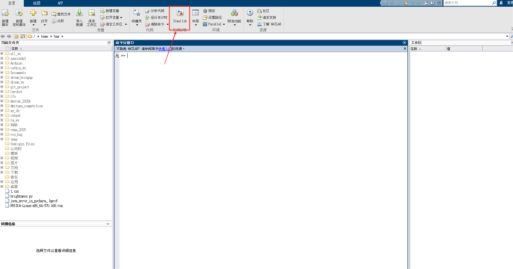
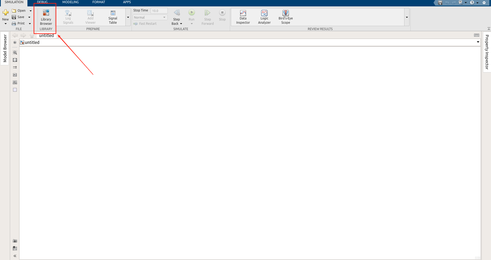
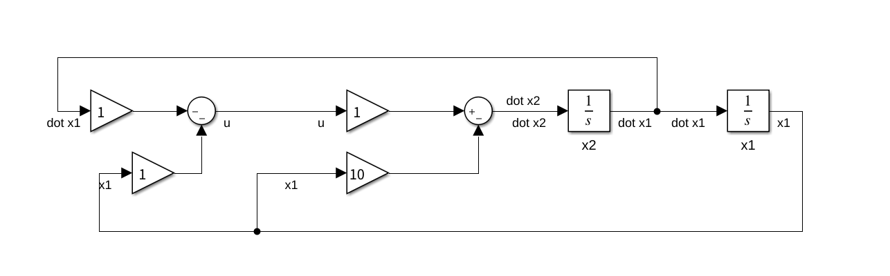
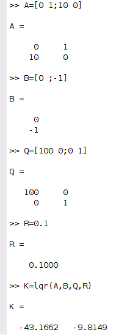
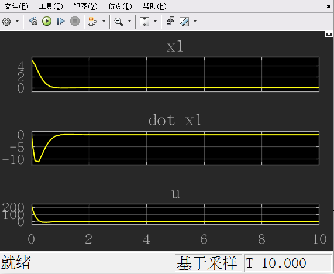
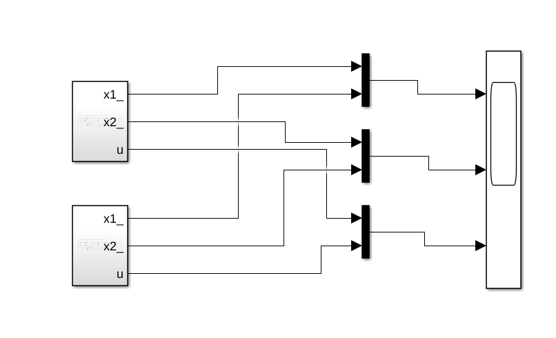
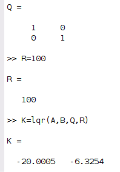
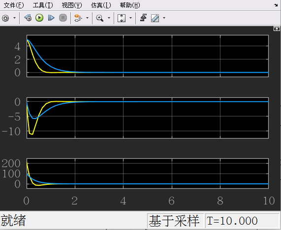

## LQR控制器

L：Linear

Q：quadratic

R：Regulator

上节课讲过，使用反馈（闭环）来设计控制器
$$
\dot{x} = Ax + Bu \\
u = -kx = -\begin{bmatrix}k_1&k_2&...\end{bmatrix}\begin{bmatrix}x_1\\x_2\\...\end{bmatrix} \\
\dot x = Ax - Bkx = (A-Bk)x \\
\dot x = Acl \;x
$$
 $\text{选择}\;K(k_1,\;k_2...)\xrightarrow{\text{改变}}\;Acl\text{的特征值}\xrightarrow{控制}\text{系统表现}$ 

为了更好更合理地计算出 k

- 引入 Cost Function （目标函数、能量函数）

$$
\min J = \int_0^{\infty\text{or某一个时间段}} x^TQx+u^TRu\;dt
$$

Q、R 都是对角矩阵，代表 x、u 不等于 0 的时候的惩罚，值越大代表对对应的 x、u 的惩罚越大

Q、R矩阵都是自己设计的

我们进入matlab来设计一个LQR控制器

根据上节课的动力学分析，建立系统模型

模型
$$
\dot x_1 = x_2\\
\dot x_2 = 10x_1+u\\
u = -k_1x_1 -k_2x_2
$$

### 建模

令初始状态 $k_1,k_2 = 0;x_1 = 5, x_2 = 0$ ，观测系统的状态

可以看出，在没有外接输入干预的情况下，如果有一个初始的偏移角度的话，其角度会越来越大，最后发散

### 使用lqr

计算k值：

带入到系统中：

可见，系统最终收敛

### 比较不同的 QR 矩阵对应的系统的稳定性

选择系统，右键，存为 subsystem

改变新系统的 QR 矩阵

带入系统，得

$\text{黄线是}\;Q = \begin{bmatrix}100& 0\\0 &1\end{bmatrix}, R = 0.1$

$\text{蓝线是}\;Q = \begin{bmatrix}1& 0\\0 &1\end{bmatrix}, R = 100$

可以看出，黄线收敛更快，输入u更大；蓝线收敛更慢，输入u更小

回看公式
$$
\min J = \int_0^{\infty} x^TQx+u^TRu\;dt
$$

Q、R矩阵可以理解为，对收敛速度和能量消耗的权衡。

Q矩阵的值越大，对应状态的收敛速度就越快；R矩阵越大，对应的输入就更小
