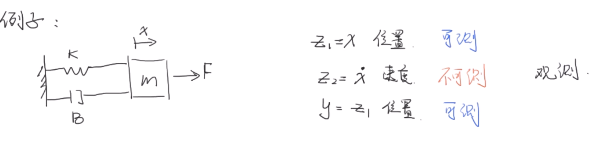

## 状态观测器的设计

 一个系统
$$
\dot x = Ax+Bu \\
y=Cx+Du 
\tag{1}
$$
假如这个系统状态x是不可测的，该怎么办？

### observer：观测器

- 根据系统的输入 $u$ 和输出 $y$ ，来估计系统的状态 $x$

---

### Luenberger Observer

令 $\hat x$ 为估计值，$\hat y$ 为估计值的输出
$$
\dot{\hat x} = A\hat x+ Bu + L(y - \hat y) \\
\hat y = C\hat x+Du
\tag 2
$$
找到一个合适 L 矩阵，使得估计值倾向于实际值

由 (2) 得
$$
\dot{\hat x} = (A-LC)\hat x+ (B-LD)u + Ly 
\tag 3
$$

- (3) 为观测器

由(1)(3) 计算得：
$$
\dot x - \dot{\hat x}= (A-LC)(x-\hat x) \\
$$
令 $e_x = x-\hat x$，目标是 $e_x \rightarrow 0$ 

即令 $A-LC$ 的特征值小于0

---

建立一个新的反馈系统，使得 $e_x \rightarrow 0$ 

这还是经典的线性系统
$$
\begin{aligned}
\begin{bmatrix}\dot x_1 \\ \dot x_2 \end{bmatrix} &= \begin{bmatrix}0 & 1 \\ -\frac{K}{m} & -\frac{B}{m}\end{bmatrix}
\begin{bmatrix}x_1\\ x_2 \end{bmatrix}+\begin{bmatrix}0 \\ \frac{1}m\end{bmatrix}
u \\
y &= \begin{bmatrix}1 & 0 \end{bmatrix}\begin{bmatrix}x_1 \\ x_2 \end{bmatrix}\\
\end{aligned}
$$

令 $m=1;B=0.5;K=1$
$$
\begin{aligned}
\begin{bmatrix}\dot x_1 \\ \dot x_2 \end{bmatrix} 
&= 
\begin{bmatrix}0 & 1 \\ -1 & -\frac12\end{bmatrix}
\begin{bmatrix}x_1\\ x_2 \end{bmatrix}
+
\begin{bmatrix}0 \\ 1\end{bmatrix}
u \\
y &= \begin{bmatrix}1 & 0 \end{bmatrix}\begin{bmatrix}x_1 \\ x_2 \end{bmatrix}\\
\end{aligned}
$$
令 $L = \begin{bmatrix}l_1 \\ l_2 \end{bmatrix}$
$$
\begin{aligned}
A-LC &= \begin{bmatrix}0 & 1 \\ \ -1 & -\frac12 \end{bmatrix} - \begin{bmatrix}l_1 \\ l_2\end{bmatrix} \begin{bmatrix}1 & 0 \end{bmatrix} \\
&=\begin{bmatrix}-l_1 & 1 \\ \ -1-l_2 & -\frac12 \end{bmatrix}\\

\end{aligned}
$$
令矩阵 $A-LC$ 的特征值都为-1
$$
\begin{vmatrix}\lambda+l_1 & -1 \\ \ 1+l_2 & \lambda+\frac12 \end{vmatrix}=0
$$

$$
\lambda^2 + (l_1 + \frac12)\lambda + 1+ \frac12l_1+l_2 = 0
$$

已知
$$
\lambda_1 = \lambda_2 = -1 
$$
解得：
$$
l_1 = 1.5,\;l_2 = -0.75
$$

- 老师这里算错了，正确的是上面这个

带入 (3) 中，得到观测器：
$$
\dot{\hat x} 
=
\begin{bmatrix}-1.5 & 1 \\ \ -0.25 & -0.5 \end{bmatrix}\hat x
+
\begin{bmatrix}0 \\ 1\end{bmatrix}u 
+ \begin{bmatrix}1.5 \\ -0.75\end{bmatrix}y
$$
