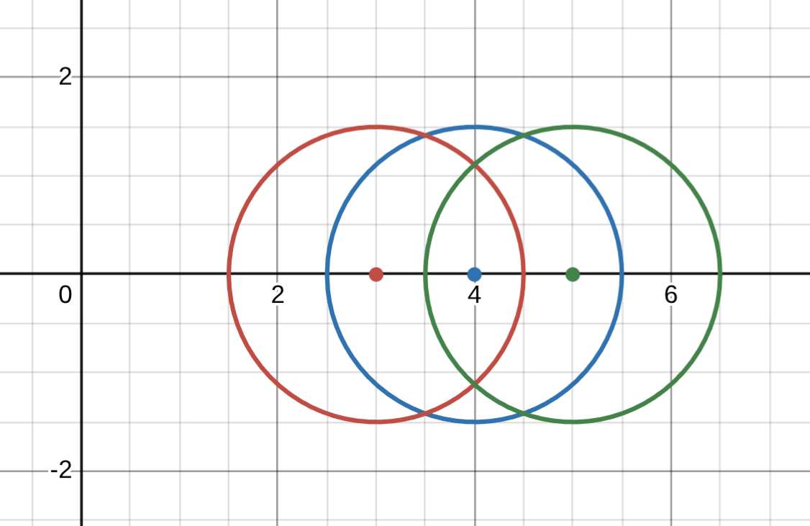

# 矩阵特征值的性质

上次课中的矩阵 A-LC 计算错了（已经改过来了），这里主要介绍特征值的一些性质

一个矩阵
$$
A-LC = \begin{bmatrix}-2.5 & 1 \\ 0.25 & -0.5\end{bmatrix}
$$
很快就能判断出所有特征值为负

如何判断的呢？

## 方法一：

对于一个方阵
$$
A_{n\times n} = \begin{bmatrix}a_{11} & \cdots & a_{1n} \\ 
\vdots & & \vdots \\
a_{n1} & \cdots & a_{nn}
\end{bmatrix}
$$
有以下性质
$$
\lambda_1 + \lambda_2 + \cdots + \lambda_n = \tr{(A)} \\
\lambda_1 \lambda_2 \cdots \lambda_n = |A|
$$
A 的特征值之和等于主对角线元素之和；A 的特征值之积等于A的行列式；

回到前面的方程中： 

- A-LC 主对角线元素和负，特征值之和小于0；
- |A-LC|为负，特征值之积小于0

易得两特征值都是负的

## 个人补充的方法二：

上面的速算方法只对二维的矩阵才比较好用，下面介绍一种比较通用的，能快速估计特征值符号的方法

**盖尔圆盘定理**

- 主观理解：**一个矩阵的所有特征值，都落在复平面上的一些圆形区域内，这些圆形区域被称为“盖尔圆盘”。**

### 第一部分：基本定理

对于矩阵
$$
A_{n\times n} = \begin{bmatrix}a_{11} & \cdots & a_{1n} \\ 
\vdots & & \vdots \\
a_{n1} & \cdots & a_{nn}
\end{bmatrix}
$$
我们定义两个量

1. 圆心：第 i 个圆的坐标 $(a_{ii}, 0)$ 
2. 半径：第 i 个圆的半径 $\sum ^n_{j=1,j\neq i} |a_{i,j}|$ 

在复平面中，可以画出 i 个圆

### 第二部分：连通分支定理

**所有的特征值都在 i 个圆所成的并集上**

有k个圆盘形成了联通区域，那么这个区域恰好包含 k 个特征值

### 举几个例子

#### eg1：

$$
A-LC = \begin{bmatrix}-2.5 & 1 \\ 0.25 & -0.5\end{bmatrix}
$$

其盖尔圆盘为

其两个特征值分别位于两个圆内，易得，所有特征值都小于等于0

#### eg2：

$$
A = \begin{bmatrix}4 & 1 & 0.5 \\ 
0.5 & 3 & 1 \\
1 & 0.5 & 5
\end{bmatrix}
$$

得到，其特征值都在这三个圆形成的并集内，特征值都大于0
