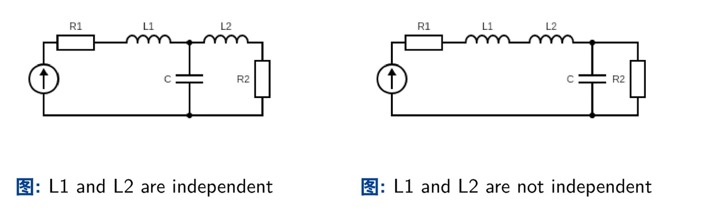

# 控制理论

## 1. 控制是什么

- 控制的核心是**反馈**

经典的闭环控制系统框图：

拿调洗澡水水温举例：

- **给定值**：你期望的水温

- **比较器**：你的大脑，负责比较当前水温和期望水温的差距

- **控制器**：也是你的大脑，这里负责的是控制你的手
- **执行器**：你的手，负责拧水龙头
- **控制量**：你的手拧水龙头的力
- **被控对象**：水龙头
- **干扰**：水龙头可能生锈了，很难拧得动
- **被控量**：实际的水温
- **反馈环节**：你伸手感受水温
- **反馈量**：当前的水温

## 仿真系统

### 理清概念

在研究仿真系统之前，我们来理清**被控量**和**状态量**的概念。

​	简单来说：

- **被控量**是系统的**输出量** 

- **状态量**是描述系统内部行为的**内部变量** 

- **被控量通常是由一个或多个状态量构成的**，但它不是状态量的全部

**类比**：回到前面调洗澡水水温的例子，此时的系统是被控对象（水龙头）

- **被控量**：实际的水温
- **状态量**：水龙头的位置、水龙头输出的水温

### 概念

分清了被控量和状态量，我们来研究仿真系统

- 仿真，就是模拟**被控对象**在真实空间中的状态，我们的研究对象就是**被控对象**这个系统（线性系统）

对于该系统，系统的**输入($u$)**是控制量+干扰，**状态量($x$)**就是系统内部的一些变量，**输出($y$)**就是被控量

我们计算这些量之间的关系，得到**状态空间方程的一般表达形式**：
$$
\begin{cases}
\dot{x} = A(t)x+B(t)u \\
y = C(t)x + D(t)u     \\
\end{cases}
$$
$A(t)$：系统矩阵

$B(t)$：控制矩阵

$C(t)$：输出矩阵

$D(t)$：直接传递矩阵

我们想要分析**输入($u$)**和**输出($y$)**之间的关系，但因为有 $\dot{x}$ 的存在，求解并不容易，所以我们引入拉普拉斯变换，来将这种导数关系变成乘法

# 现代控制理论

 

## Lec2-状态空间基本概念

### **状态变量**：

- **最小性**：刻画一个系统变化的过程所需的最少变量

- **独立性**（线性无关）：变量之间都是线性不相关的

  独立性也是在保证最小性，有了最小性，我们就知道研究一个系统时，对应的状态变量该怎么选

比如，我们研究上面的电路系统。左图的`L1`和`L2`电感，关系明显不是线性的（因为有电感），选择状态变量时，`L1`和`L2`可以一起选；而右图`L1`和`L2`的变化是一样的，是线性相关的，选择状态变量时，`L1`和`L2`不可以一起选。

那么，在一个系统中，具体该选择多少个状态变量呢？具体来说，状态变量的数量等于：

- 系统微分方程的阶数：$y^n+a_{n-1}y^{n-1}...+ay = U$
- 传递函数模型的分母多项式的阶数：$G(s) = \frac{y(s)}{U(s)}$
- 系统中独立储能单元的数量

根据第三条性质，我们回到前面的电路系统。对于左图而言，`L1`和`L2`是独立的，共有三个独立的储能单元（`L1`、`L2`、`C`），所以用三个变量去刻画这个系统；而对右图而言，`L1`和`L2`是线性相关的，共有两个独立的储能单元，所以用两个变量来刻画这个系统

### 建模

经典控制理论的模型：

现代控制理论的模型：

对于现代控制理论的模型，我们建模得

$$
\begin{cases}
\dot{x}(t) = f(x(t),u(t),t) \\
y(t) = g(x(t), u(t),t)    
\\\end{cases}
\tag{1}
$$

- 第一个式子是**状态方程**，第二个式子是**输出方程**

假如状态和输出与时间无关，得到：（**时不变系统**）
$$
\begin{cases}\dot{x}(t) = f(x(t),u(t)) \\
y(t) = g(x(t), u(t))    \\
\end{cases}\tag{2}
$$

- 注意，这里的$x(t)$、$y(t)$、$u(t)$都是向量：（注意下标）

$$
x(t)=
\begin{bmatrix}
 x_1(t)\\
 x_2(t)\\
 ...\\
 x_n(t)\\
 \end{bmatrix}
 
 ,\,\,
 
 y(t)=
\begin{bmatrix}
 y_1(t)\\
 y_2(t)\\
 ...\\
 y_m(t)\\
 \end{bmatrix}
 
 ,\,\,
 
 u(t)=
\begin{bmatrix}
 u_1(t)\\
 u_2(t)\\
 ...\\
 u_r(t)\\
 \end{bmatrix}
$$

将$(2)$展开：
$$
\begin{cases}
\dot{x}_1(t)=f_1(x_1, x_2,...x_n;u_1,u_2,...u_r) \\
\dot{x}_1(t)=f_2(x_1, x_2,...x_n;u_1,u_2,...u_r) \\
... \\
\dot{x}_n(t)=f_n(x_1, x_2,...x_n;u_1,u_2,...u_r) \\
\end{cases}
$$

$$
\begin{cases}
\dot{y}_1(t)=g_1(x_1, x_2,...x_n;u_1,u_2,...u_r) \\
\dot{y}_1(t)=g_2(x_1, x_2,...x_n;u_1,u_2,...u_r) \\
... \\
\dot{y}_m(t)=g_m(x_1, x_2,...x_n;u_1,u_2,...u_r) \\
\end{cases}
$$

假如$(1)$系统是线性的，则有：（**线性系统**）
$$
\begin{cases}
\dot{x}(t) = A(t)x(t)+B(t)u(t) \\
y(t) = C(t)x(t) + D(t)u(t)     \\
\end{cases}
\tag{3}
$$
（叠加原理）

假如$(1)$是线性且时不变，则有（**线性时不变系统**）
$$
\begin{cases}
\dot{x}(t) = Ax(t)+Bu(t) \\
y(t) = Cx(t) + Du(t)     \\
\end{cases}
$$
由于$u(t)$一般是知道的，所以$Du(t)$可以看成一个常数，所以式子进一步简化得：
$$
\begin{cases}
\dot{x}(t) = Ax(t)+Bu(t) \\
y(t) = Cx(t)  \\
\end{cases}
\tag{4}
$$
上面这个式子就是之后研究的式子

$A(t)$：系统矩阵，大小为 $n*n$ 

$B(t)$：控制矩阵，大小为 $n*r$ 

$C(t)$：输出矩阵，大小为 $m*n$ 

$D(t)$：直接传递矩阵，大小为 $m*r$ 

经典控制中常用系统框图来表示系统，那能否把现代控制理论的模型用系统框图表示出来？

当然可以：

但一般来说不考虑 $D$ 

