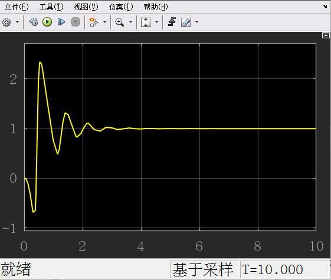
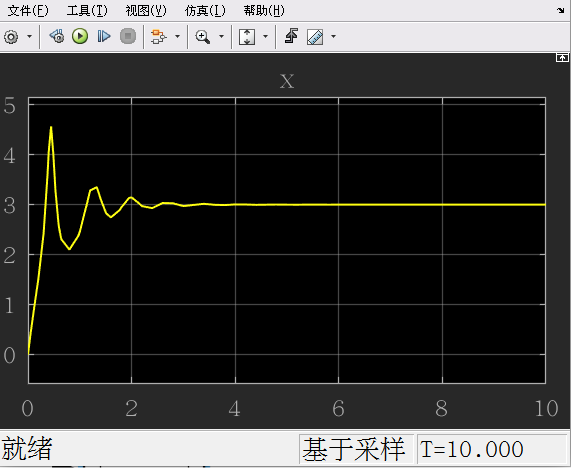

# 非线性自适应控制器

现在有一个系统
$$
\dot x = ax^2 + u
$$
追踪目标：$e\rightarrow 0$
$$
e = x_d - x \\
\dot e = \dot x_d -  ax^2 - u \\
$$
令 $V = \frac12e^2$ （正定）

有 $\dot V = e\dot e = e(\dot x_d -  ax^2 - u)$ 

为了让 $\dot V$ 负定，我们令 $-ke = \dot x_d -  ax^2 - u$，其中 $k>0$ 

即 $u = \dot x_d -  ax^2 + ke$

- 假如这个系统的状态转移矩阵 $a$ 我们都知道，那这就是一个 Exactly known System （已知系统）
- 假如状态转移矩阵 $a$ 我们不知道，那么该怎么办呢？

**假设：a 为常数，或者至少变化得十分缓慢，即 $\dot a = 0$** 

定义：

- $\hat a$ ：a 的估计值
- $\tilde{a}$：a 的估计误差

$$
\tilde{a} = a - \hat a \\
\dot{\tilde{a}} = - \dot{\hat a}
$$

构建李雅普诺夫方程 $V(e,\tilde a)$
$$
V(e, \tilde a) = \frac12 e^2 + \frac12 \tilde a^2
$$

$$
\dot V(e, \tilde a) = e\dot e + \tilde a\dot{\tilde a}  = e(\dot x_d - ax^2 - u) - \tilde a\dot{\hat a}
$$

由于 $u = \dot x_d - \hat ax^2 + ke$ ，带入得
$$
\begin{aligned}
\dot V(e, \tilde a) &= e(- ax^2 + \hat ax^2 - ke) - \tilde a\dot{\hat a} \\
&= -e[(a - \hat a)x^2 + ke] - \tilde a\dot{\hat a} \\
&= -e[\tilde ax^2 + ke] - \tilde a\dot{\hat a} \\
&= -{\tilde a}(\dot{\hat a} + ex^2) - ke^2
\end{aligned}
$$
为了能让 $\dot V(e, \tilde a)$ 负定，我们希望 $\dot{\hat a} + ex^2$ 这一部分也是负定的，但是这很难做到，所以我们可以让其变成 0

即令 $\dot{\hat a} = -ex^2$ ，这样李雅普诺夫函数 $\dot V(e, \tilde a) = -ke^2$ 

- 注意，这个李雅普诺夫函数是半负定的系统

正常来说令 ${\hat a} = \int_0^t-ex^2dt$ 就行了，但是还没证明 $e$ 有极限，以及可积

> ## Lyapunov-like Lemma
> 
> 如果标量函数 $V(x)$ 满足：
> 
> 1. $V(x)\geq 0$有下界
> 2. $\dot V(x)\leq-g(t)$, where $g(x) \geq0$ 
> 3. $\dot g(t) \in L_{\infty}$ （即 $\dot g(t)$ 有界，或者说 $g(t)$ 是一致连续的）
> 
> - 那么 $\lim_{t\rightarrow \infty}g(t) = 0$ 

将这个定理用在上面的系统中

令 $g(t) = ke^2$ ，分析 Lyapunov-like Lemma 定理的各个条件

1. 已知 $V(e)$ 正定，满足

2. $\dot V(e)= -ke^2\leq-g(t)$ 
3. $\dot g(t) = 2ke\dot e$  ，由于系统是李雅普诺夫稳定的，所以 $e,\dot e$ 有界，所以其乘积有界

- 那么 $\lim_{t\rightarrow \infty}g(t) = 0$ ，即 $\lim_{t\rightarrow \infty}ke^2 = 0$ 

最后，拿出前面算的 $u = \dot x_d -  \hat ax^2 + ke$ ，将 $\hat a = \int_0^t-ex^2\,dt$ 带入得

得到
$$
u = \dot x_d + x^2\int_0^tex^2\,dt + ke
$$

## simlink 仿真

搭建仿真

结果：

图一：$\hat a$ 的图（初始的 $\hat a$ 为0， $a$ 为1）

图二：$x$ 的图（初始的 $x$ 为 0， $x_d$ 为3）

可见，在 a 不确定的情况下，系统依然能收敛，而且对 a 有很好的预测

---

课后习题答案：
$$
\hat {\alpha} = \frac1m\int_0^tx_1^3(\dot x_{1d} + k_1e - x_2) \,dt
$$
