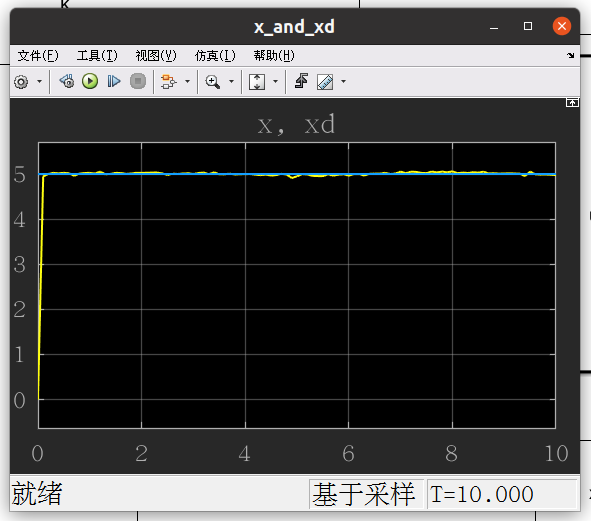
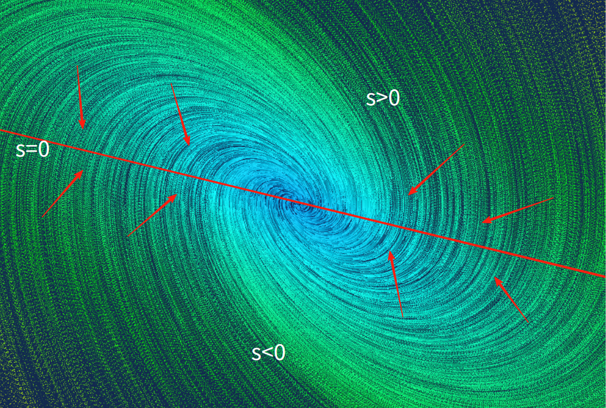

# Robust Control 鲁棒控制

## 滑膜 sliding mode

对于一个系统
$$
\dot x = ax^2 + u
$$
a 未知

上一节课讲的 Adaptive controller自适应控制器，可以设计类似于
$$
u = \dot x_{d} +x^2\int_0^tex^2\,dt + ke
$$
的形式，来估计a并使 $x\rightarrow x_d$ 

在自适应控制器中，前提是 $a$ 是一个常数，而在滑膜控制中， $a$ 不再是一个常数，只知道 $a$ 是一个有界的数 $|a| \leq|\overline a|$ ，目标还是使 $x\rightarrow x_d$ ，$e\rightarrow 0$

系统方程
$$
\dot x = f(x) + u
$$

$$
e = x_d - x \\
\dot e = \dot x_d -\dot x = \dot x_d - f(x) - u
$$

我们令
$$
\boxed{
u = \dot x_d + ke + \rho(x)\frac{|e|}{e}
}
$$
其中
$$
|f(x)| < \rho(x) \\
\frac{|e|}{e} = sign(e) = 
\begin{cases}
1 &e>0 \\
0 &e=0 \\
-1 &e<0
\end{cases}
$$

## 证明：为什么这个形式的控制器能使系统稳定

令 
$$
V(e) = \frac12e^2 \\
$$
有
$$
\begin{aligned}
\dot V(e) &= e \dot e \\
&= e[\dot x_d - f(x) - u] \\
&= e[\dot x_d - f(x) - \dot x_d - ke - \rho\frac{|e|}{e}] \\
&= -e[f(x) + ke + \rho\frac{|e|}{e}] \\
&= -ke^2 - ef(x) - \rho|e| \\
&\leq -ke^2 + |e||f(x)| - \rho|e| \\
\end{aligned}
$$
由于 $|f(x)| < \rho(x) $ ，有
$$
\begin{aligned}
\dot V(e) 
&\leq -ke^2 \\
\end{aligned}
$$
将 $e^2 = 2V(e) $ 带入
$$
\begin{aligned}
\dot V(e) 
&\leq -2kV(e) \\
\end{aligned}
$$
解这个微分方程不等式，引入一个 $S(t)$，其中 $S(t) >0$ 
$$
\dot V(e) + 2kV(e) = -S(t)
$$
解这个一阶非齐次线性方程

>
>
>回顾：一阶线性微分方程
>
>1. $\dot y + P(x)y = 0$ 的通解
>
>$$
>y = Ce^{-\int P(x)\,dx}
>$$
>
>2. $\dot y + P(x)y = Q(x)$ 的通解
>
>$$
>y = e^{-\int P(x)\,dx} [\int Q(x)e^{\int P(x)\,dx}dx +C]
>$$
>
>

解得
$$
\begin{aligned}
V(e) &= C\exp(-\int_0^t2k\,dt) + \exp(-\int_0^t2k\,dt)\int_0^t-S(\tau)\exp(\int_0^t2k\,dt)d\tau \\
&= V(0) \exp(-2kt) - \exp(-2kt)\int_0^tS(\tau)\exp(2k\tau)d\tau \\
&= V(0) \exp(-2kt) - S(t)[\,1-\exp(2kt)\int_0^t\exp(-2k\tau )\,d\tau\,] \\
&= V(0) \exp(-2kt) - S(t)(1+\frac1{2k}) \\
&\leq V(0) \exp(-2kt)
\end{aligned}
$$
将 $V(e) = \frac12e^2$ 带入
$$
\begin{aligned}
\frac12 e(t)^2 &\leq \frac12 e(0)^2 \exp(-2kt) \\
|e(t)| &\leq |e(0)|\exp(-kt) \\
\end{aligned}
$$
可以看出 $e(t)$ 是指数渐进稳定的一种形式

---

系统 $\dot x = f(x) + u$ ，$|f(x)|<\rho(x)$ 

当令 $u = ke + \dot x_d + \rho\frac{e}{|e|}$ 时，有：在 $t\rightarrow \infty$ 时， $e = x_d - x\rightarrow 0$ 

我们对 $e $ 求导：
$$
\dot e = -ke - f(x) - \rho(x)\frac{e}{|e|} \\
$$

---

### 解刚才的例子

$$
\dot x = ax^2 + u \\
$$

其中 $|a| \leq |\overline a|,\,f(x)=ax^2$ 

所以 $f(x) \leq |\overline a|x^2$ 

令 $\rho (x) = |\overline a|x^2+0.1$ 

所以 $f(x) < \rho(x) $ 

令 $u = ke + \dot x_d + (|\overline a|x^2+0.1)\frac{e}{|e|}$ 

## 搭建仿真

发现：

1. 滑膜控制能让系统很好地追踪想要的值
2. 在平衡时，输出 $u$ 会正负来回变化
3. 参数 $k$ 的大小基本上决定了**一开始**追踪 $x_d$ 的 $u$ 的大小
4. 参数 $\overline a$ 的大小基本上决定了**稳态时**追踪 $x_d$ 的 $u$ 的大小
5. 当参数 $\overline a$ 设置错误（比如 $a$ 最大是2但是设置成了1），系统的输入会指数级增大，在短时间内失控

# 补充

can老师的课程还少了一些关于滑膜函数 $s(x)$ 的介绍，这里来补充一下，参考视频：[什么是滑膜控制？可视化讲解](https://www.bilibili.com/video/BV1zauPzJE6n?spm_id_from=333.788.recommend_more_video.1&trackid=web_related_0.router-related-2206146-j9vhc.1762079645426.431&vd_source=fa702e26771092fb8707df94a1159b02)

回到第二节课的例子

系统：
$$
\begin{bmatrix}
\dot{x_1} \\
\dot{x_2}
\end{bmatrix}
=
\begin{bmatrix}
0 & 1\\
-K/m & -B/m
\end{bmatrix}

\begin{bmatrix}
x_1 \\
x_2
\end{bmatrix}
+
\begin{bmatrix}
0\\
1/m
\end{bmatrix}
\begin{bmatrix}
u(t)
\end{bmatrix}
$$

$$
y =
\begin{bmatrix}
1 & 0\\
\end{bmatrix}
\begin{bmatrix}
x_1 \\
x_2
\end{bmatrix}
$$

令 $K = 1, B= 1,m=1$ ，系统的相图为

现在，我们设一个滑膜面 $s(x)=0$ ，目的是让系统先接近滑膜面，再从滑膜面收敛

对于系统
$$
\dot x_2 = -x_1 -x_2 + u
$$
令滑膜面 $s(x) = bx_1 + x_2 = 0$ 

（一般取滑膜面是取$s = C^T(x_1, x_2...)$ 。对于二维系统，常用 $s = ce(t) + \dot e(t)$ ）

但是系统的初始状态是随机的，要有一种方法，能让系统在任何位置，都能到达滑膜面
$$
\begin{cases}
\text{when}\;s>0,\;\text{let}\;\dot s<0 \\ 
\text{when}\;s<0,\;\text{let}\;\dot s>0 \\ 
\end{cases}
$$
只要让 $s$ 与 $\dot s$ 符号相反即可，即 $s\cdot \dot s < 0$。这样，无论系统在哪里，都能向 $s(x) = 0$ 的滑膜面移动

有很多种 $\dot s$ 的设计方式：

1. $\dot s = -\eta \;sign(s)$ ，恒定速率到达率
2. $\dot s = -\eta \;sign(s)-Ks$ ，指数到达率
3. ...

统一表示为 
$$
\dot s = h(s(x)) \tag 1
$$
对于一般的系统，我们将状态转移矩阵表示为
$$
\dot x = f(x) + g(x)u(t)
$$
系统滑膜面为，$s = f(x) = C^Tx$ 

对 $s = f(x) = C^Tx$ 两边求导，得 $\dot s = C^T \dot x =  C^T[f(x) + g(x)u(t)]$  

将 (1) 带入上式
$$
h(s(x)) = C^T[f(x) + g(x)u(t)] \\
$$
将 $u(t)$ 提取出来，得到标准的滑膜公式
$$
\boxed{
u(t) = (C^Tg(x))^{-1}(-C^Tf(x)+h(s(x))) \\
}
$$
回到之前的系统
$$
\begin{bmatrix}
\dot{x_1} \\
\dot{x_2}
\end{bmatrix}
=
\begin{bmatrix}
0 & 1\\
-1 & -1
\end{bmatrix}

\begin{bmatrix}
x_1 \\
x_2
\end{bmatrix}
+
\begin{bmatrix}
0\\
1
\end{bmatrix}
\begin{bmatrix}
u(t)
\end{bmatrix}
$$
根据
$$
\boxed{
\dot x = f(x) + g(x)u(t)
}
$$

$\eta = 1$，有 $\dot s = - \frac{s}{|s|}$ 
$$
f(x) = 
\begin{bmatrix}
x_2 \\
-x_1-x_2 \\
\end{bmatrix}
;\;g(x) =
\begin{bmatrix}
0 \\
1 \\
\end{bmatrix}
;\;C = 
\begin{bmatrix}
b \\
1 \\
\end{bmatrix}
;\;s(x) = 
bx_1+x_2
;\;h(s) = - \frac{s}{|s|}
$$
解得：
$$
u = -bx_2+x_1+x_2 -\frac{bx_1+x_2}{|bx_1+x_2|}
$$
带入原方程得
$$
\dot{x}_1 = x_2 \\
\dot x_2 = -bx_2 -\frac{bx_1+x_2}{|bx_1+x_2|}
$$
绘制相图

$b = 1$：

$b=0$：

$b = 0.5$：

所以，关于滑膜，一共有两个需要设计的，

1. 第一个是滑膜面，即 $s(t) = 0$ 
2. 第二个是趋近律，即 $\dot s(t) = h(s)$ 
