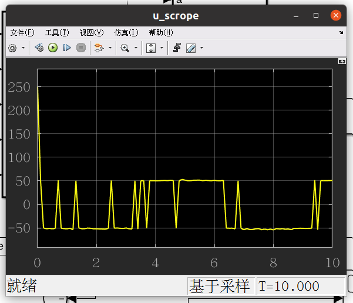
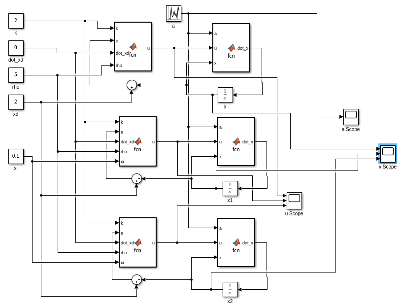
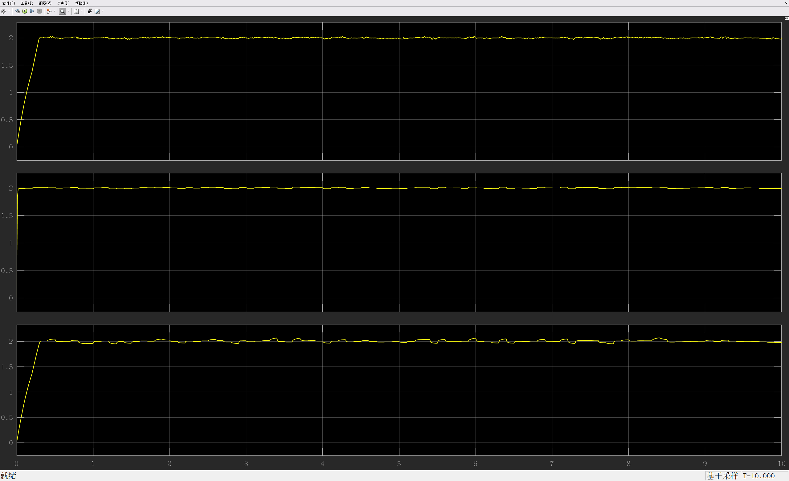
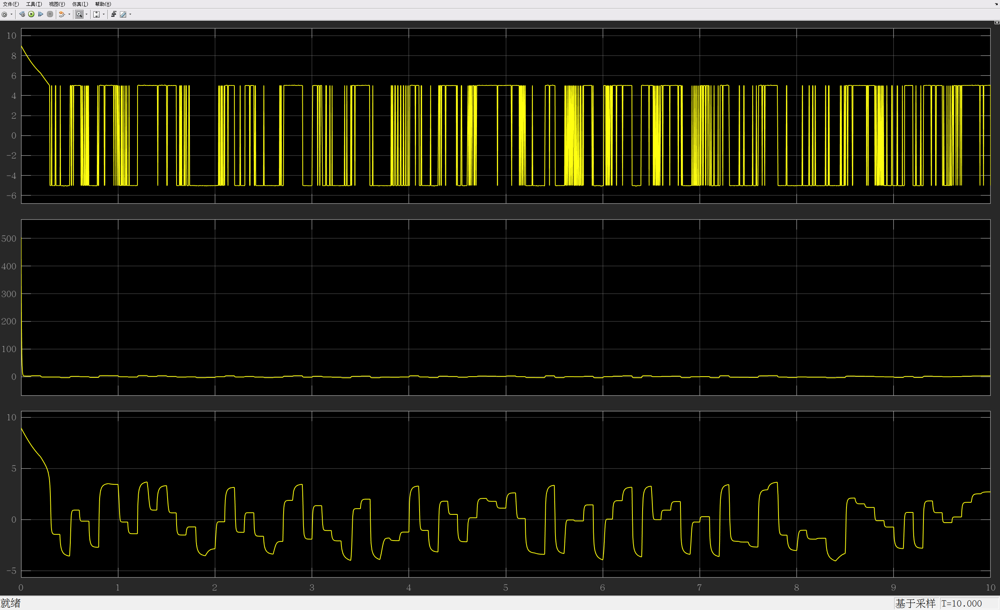
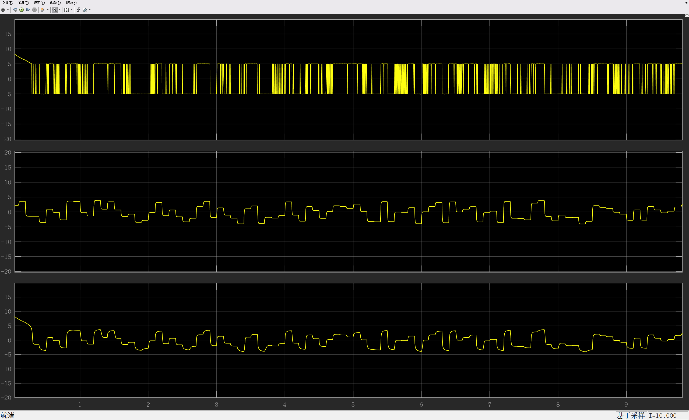

# 鲁棒控制

系统
$$
\dot x = f(x) + u
$$
已知 

​	$|f(x)| \leq \rho(x)$ 

​	$e = x_d - x$ 

​	$\dot e = \dot x_d - \dot x = \dot x_d-f(x) - u$ 

令 $u = ke +\dot x_d + u_{aux}$ 

其中 $u_{aux}$ 为辅助控制，目的是在不知道具体的系统状态空间时使用

上一节课的 $u_{aux} = \rho\frac{e}{|e|}$ （滑模控制）

有一个缺点，就是控制量会正负不断的变化

这对于控制器是很大的挑战，所以这里介绍其他的辅助控制 $u_{aux}$ 
$$
u_{aux2} = \frac{1}{\xi}\rho^2e \; \text{(High Gain)}\\
u_{aux3} = \frac{\rho^2e}{\rho|e|+\xi} \; \text{(High Frequency)}\\
$$
条件： $|f(x)| < \rho(x), \,\xi >0$  

## 证明两个 $u_{aux2}$ 的李亚普诺夫稳定性

### 1. $u_{aux2} = \frac{1}{\xi}\rho^2e$ 的稳定性：

令 $ V = \frac12e^2 $ 
$$
\begin{aligned}
\dot V(e) &= e \dot e \\
&= e[\dot x_d - f(x) - u] \\
&= e[\dot x_d - f(x) - \dot x_d - ke - \frac{1}{\xi}\rho^2e] \\
&= -e[f(x) + ke + \frac{1}{\xi}\rho^2e] \\
&= -ef(x) - ke^2 - \frac{1}{\xi}\rho^2e^2 \\
&\text{because}\; (-ef(x) \leq |e||f(x)| \leq |e|\rho) \\
&\leq - ke^2 + |e|\rho  - \frac{1}{\xi}\rho^2|e|^2 \\
&\leq - ke^2 + \rho|e| \,\,(1- \frac{1}{\xi}\rho|e|) \\
\end{aligned}
$$

---

$$
\begin{aligned}
\text{case1:}& \;\;\rho|e| \geq \xi \\
&\Rarr 1- \frac{1}{\xi}\rho|e| \leq 0 \\
&\Rarr \rho|e|(1- \frac{1}{\xi}\rho|e|) \leq 0 \\
&\Rarr \boxed{\dot V \leq -ke^2} \\
\end{aligned}
$$

---

$$
\begin{aligned}
\text{case2:}&\;\; 0 \leq \rho|e| \leq \xi \\
&\Rarr  1- \frac{1}{\xi}\rho|e| \leq 1 \\
&\Rarr \rho|e|(1- \frac{1}{\xi}\rho|e|) \leq \rho|e| \leq \xi\\
&\Rarr \dot V \leq - ke^2 + \xi  \\

&\Rarr \dot V \leq - 2kV + \xi  \\
 \text{Let} &\;\delta(t)>0 \\
\;\;\;\;\;\; &\dot V + \delta(t) = - 2kV + \xi  \\
\;\;\;\;\;\; &\dot V + 2kV  = \xi - \delta(t)  \\
\end{aligned}
$$

$$
\text{where}\; \frac{dy}{dx} + P(x)y = Q(x) \Rarr y = e^{-\int P(x) dx} \left[ \int Q(x) e^{\int P(x) dx} dx + C \right]
$$

$$
\begin{aligned}
\text{therefore}\; V &= e^{-\int 2k dt} \left[ \int_0^t [\xi - \delta(t)] e^{\int_0^t 2k dt} dt + C \right] \\
&= e^{-2kt} \int_0^t [\xi - \delta(t)] e^{2kt} dt + C e^{-2kt} \\
&= -e^{-2kt} \int_0^t\delta(t) e^{2kt} dt +\xi e^{-2kt} \int_0^t e^{2kt} dt + C e^{-2kt} \\
&\leq \xi e^{-2kt} \int_0^t e^{2kt} dt + C e^{-2kt} \\
&\leq e^{-2kt} \left(\xi\int_0^t e^{2kt} dt + C \right) \\
&\leq e^{-2kt} \left\{ \xi \left[ \frac{1}{2k}\left(e^{2kt}-1\right)\right] + C \right\} \\
&\leq \frac{\xi}{2k} - \frac{\xi}{2k}e^{-2kt} + Ce^{-2kt}  \\ \\

&\text{while} \;t\rarr \infty , V = \frac12e^2\\
&\;\;\;\;\;\;\;\;   \boxed  {|e| \leq \sqrt{\frac{\xi}{k}}}

\end{aligned}
$$
可见，最终的结果并不是为0，而是在一个范围内，我们把这种结果称为 Globally Uniformly Ultimately bounded **(GUUB)** 全局一致最终有界

当 $\xi$ 非常小时，就可以考虑 $e\rarr 0$ 了，但是因为 $u_{aux} = \frac{1}{\xi}\rho^2e$ ，会导致输入很大，所以要权衡收敛和输入的关系

### 2. $u_{aux3} = \frac{\rho^2e}{\rho|e|+\xi}$ 的稳定性：

令 $ V = \frac12e^2 $ 
$$
\begin{aligned}
\dot V(e) &= e \dot e \\
&= e[\dot x_d - f(x) - u] \\
&= e[\dot x_d - f(x) - \dot x_d - ke - \frac{\rho^2e}{\rho|e|+\xi}] \\
&= -e[f(x) + ke + \frac{\rho^2e}{\rho|e|+\xi}] \\
&= -ef(x) - ke^2 - \frac{\rho^2e^2}{\rho|e|+\xi} \\

&\text{where}: -ef(x) \leq |e||f(x)| \leq |e|\rho \\
&\leq - ke^2 + \rho|e|  - \frac{\rho^2e^2}{\rho|e|+\xi} \\
&\leq - ke^2 + \rho|e| \,\,\left(1- \frac{\rho|e|}{\rho|e|+\xi}\right) \\
&\leq - ke^2 + \xi \,\,\left(\frac{\rho|e|}{\rho|e|+\xi}\right) \\

&\text{where}: 0<\frac{\rho|e|}{\rho|e|+\xi} <1\\
&\leq - ke^2 + \xi
\end{aligned}
$$

此时的情况和 $u_{aux2} = \frac{1}{\xi}\rho^2e$ 的 case2 一样，同理可得：
$$
\boxed  {|e| \leq \sqrt{\frac{\xi}{k}}}
$$
同样的，由于 $u_{aux3} = \frac{\rho^2e}{\rho|e|+\xi}$ 的形式和上述结果：$\xi$ 越大，收敛范围越大，输出越小； $\xi$ 越小则反之

## 课后习题

### matlab模型

仿真结果：

在相同的 $a,\; k,\; x_d,\; \rho,\;\xi$ 等参数（具体如上图）的情况下，结果如下：

#### 开始到稳态过程中的情况

**状态x：**

**输入 u：** 

主要的特点就是 $u_{aux2}$ 的输入很大，收敛速度很快，其他反之

#### 稳态时的情况

**状态x：**

**输入 u：**

 $u_{aux1},u_{aux2},u_{aux3}$ 对应的输入和状态都有很大的区别：

- $u_{aux1}$ 对应的输入 $u$ 的值比较恒定，但是大小跳变太快；对应的状态 $x$ 会有高频率且尖锐的振荡，但稳态误差会比较小
- $u_{aux2}$ 对应的输入 $u$ 的值跳变速度较慢，且跳变的幅度小，但是输入和 $u_{aux1}$ 一样不光滑；对应的状态 $x$ 收敛的很好，能在较小的的范围内

- $u_{aux3}$ 对应的输入 $u$ 的值比较光滑，跳变幅度也小；对应的状态 $x$ 收敛性较差，只能在较大的范围内收敛

