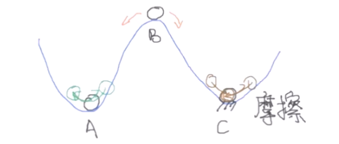

# 李雅普诺夫稳定性分析

对于一个系统来说，平衡点大概分成三类

1. 离开平衡点后，反应随时间不变，表现为在平衡点附近震荡
2. 离开平衡点后，反应随时间增大，表现为发散
3. 离开平衡点后，反应随时间减小，表现为收敛到0

这三类可以分别对应图中的A、B、C

`A、C -> 稳定`

`B -> 不稳定`

所以，不严谨地说，一个稳定的系统，离开平衡点后，反应应该随时间衰减，至少不增加。

---

换成严谨的数学语言来说

- 李雅普诺夫稳定性

$$
\forall t_o,\,\,\,\forall\epsilon,\,\,\,
\exists \delta(t_o,\epsilon):
\Vert x(t_0)\Vert < \delta(t_0,\epsilon) 
\,\,
\Rightarrow
\,\,
\forall t \geq t_0\,\,\,\ \Vert x(t)\Vert < \epsilon
$$

- 渐进稳定性

$$
\exists\delta(t_o)>0:
\Vert x(t_0)\Vert < \delta(t_0) \Rightarrow \lim_{t\rightarrow \infty}\Vert x(t)\Vert = 0
$$

举一个例子，对于一个二阶系统而言，已知 $\dot x = f(x_1, x_2)$ ，初始状态是 $x(t_0)$ 

- 如果系统是李雅普诺夫稳定的，则

  对于任意扰动小于$\delta(t_o,\epsilon)$ 的初始状态 $x(t_0)$ ，到时间 $t$ 后，有状态 $x(t)$ 的范数小于 $\epsilon$ 

- 如果系统是渐进稳定的，则

  对于任意扰动小于$\delta(t_o,\epsilon)$ 的初始状态 $x(t_0)$ ，当时间 $t$ 趋近于无穷大时，有状态 $x(t)$ 的范数等于0

---

### 判断稳定性的方法（李雅普诺夫第一方法）

- **直接法**：求解微分方程

​	在前面的class_3已经讲过了一部分，这里直接把之前的结论贴过来

​	 对于一个二维的系统，其特征值和平衡点的关系：

| $\lambda _1, \lambda_2$ 的范围                               | 相图性质 | 平衡点性质                          |
| ------------------------------------------------------------ | -------- | ----------------------------------- |
| $\lambda_1 < 0, \lambda_2 < 0$                               | 聚集     | 稳定 (stable point)                 |
| $\lambda_1 > 0, \lambda_2 < 0$   or   $\lambda_1 < 0, \lambda_2 > 0$ | 鞍形     | 不稳定 (saddle point)               |
| $\lambda_1 < 0, \lambda_2 < 0$                               | 发散     | 不稳定 (unstable point)             |
| $\lambda = a \pm bi,\,\,a = 0$                               | 椭圆     | 稳定，但并非渐近稳定 (center point) |
| $\lambda = a \pm bi,\,\,a > 0$                               | 螺旋向外 | 不稳定 (unstable point)             |
| $\lambda = a \pm bi,\,\,a < 0$                               | 螺旋向内 | 稳定 (stable point)                 |

拓展到一般的线性时不变系统（不止是二维系统）

| stability             | $\lambda = a+bi$                       |
| --------------------- | -------------------------------------- |
| Lyapunov stable       | 所以特征值的实部都是非正的 ($a\leq 0$) |
| Asymptotically stable | 所以特征值的实部都是负的 ($a < 0$)     |
| unstable              | 只要有一个实部为正                     |

对于求解非线性系统，一般是在平衡点附近线性化，然后再求解非线性方程

---

### 判断稳定性的方法（李雅普诺夫第二方法）

- 第二法就比较天才了，来源于一个朴素的想法：**稳定的系统能量总是不断被耗散的**，李雅普诺夫通过定义一个标量函数 $V(x)$ （通常能代表广义能量）来分析稳定性。这种方法的避免了直接求解方程，也没有进行近似线性化，所以也一般称之为直接法。
- 流程：找到一个标量函数 $V(x)$ ，使得 $V(x)$ 满足一些特性，然后分析 $\dot V(x)$ 的特性，来得到系统的稳定性

听着有点玄学，我们一步步分解这句话

1. "找到一个标量函数 $V(x)$ "

   怎么找？随便找？对，就是随便找，但一般会有一些技巧，常见方法是取二次型

2. "使得 $V(x)$ 满足一些特性"

   总不能随便写一个标量函数就说是 $V(x)$ 吧，标量函数 $V(x)$ 自身要满足下面两个特性

   1. 当且仅当 $x = 0$ 时，才有 $V(x) = 0$ 
   2. 当且仅当 $x≠0$ 时，才有 $V(x)>0$ 

3. "分析 $\dot V(x)$ 的特性，得到系统的稳定性"

   $\dot V(x)$ 的定义：$\dot V(x) = \frac{d}{dt}V(x) = \sum_{i = 1}^{n} \frac{\partial V(x)}{\partial x} f_i(x)$ 

   - **若 $x≠0$ ，有 $\dot V(x) \le 0$ ，则称系统在李雅普诺夫意义下是稳定的**
   - **若 $x≠0$ ，有 $\dot V(x)<0$ ，则系统是渐进稳定的**

>- 举个例子：
>
>  对于一个二维非线性系统
>
>$$
>\dot x_1(t)=x_2−x_1(x_{1}^2+x_{2}^2) \\
>\dot x_2(t)=−x_1−x_2(x_{1}^2+x_{2}^2)
>$$
>
>​	如果我们定义李雅普诺夫函数
>
>$$
>V(x)=x_1^2+x_2^2
>$$
>
>​	则有
>
>$$
>\dot V (x)=2x_1\dot x_1+2x_2 \dot x_2=−2(x_1^2+x_2^2)^2
>$$
>
>​	 显然， 当$x≠0$ 时，有 $\dot V(x)<0$ ，所以系统是渐进稳定的

这就是李雅普诺夫第二方法，可以认为是一个先射箭再画靶的过程：先找满足条件 $V(x)$ ，找到了就可以判断稳定性。每个系统的 $V(x)$ 函数理论上是无限个的。

对于复杂的系统，李雅普诺夫函数的选择可以称得上一门玄学，但不得不承认，该方法在面对非线性系统时，不用求解复杂的微分方程，确实会方便很多。而且相对于李雅普诺夫第一方法（将非线性系统线性化，再判断稳定性的方法），李雅普诺夫第二法不用线性化来简化系统，结论会更加严谨。

关于李雅普诺夫稳定性分析，可以看知乎上的潘工大佬的文章，讲的很好： [J Pan](https://zhuanlan.zhihu.com/p/58738073)
