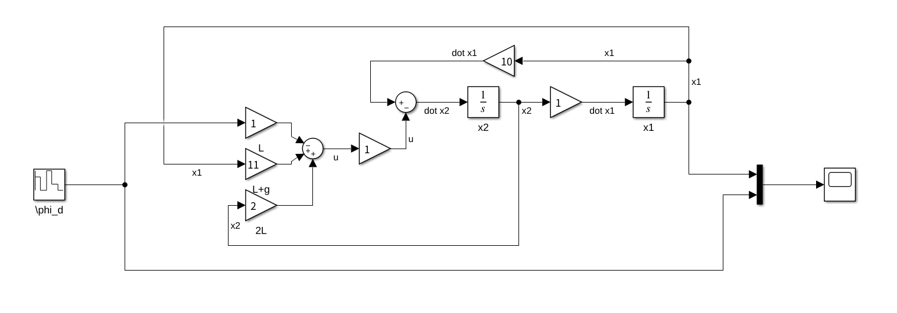
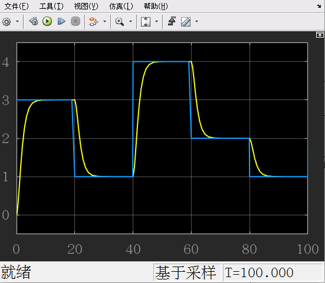

# 轨迹跟踪

回到 class7 后面的一个例子

系统模型
$$
\ddot\phi + \frac 1L\ddot\delta - \frac gL\phi=0
$$
写成矩阵：
$$
\begin{bmatrix}
\dot x_1 \\ \dot x_2
\end{bmatrix}
= 
\begin{bmatrix}
0 & 1 \\
\frac gL & 0
\end{bmatrix}

\begin{bmatrix}
x_1 \\ x_2
\end{bmatrix}
+
\begin{bmatrix}
0 \\ -\frac1L
\end{bmatrix}
u
$$
我们当时设计的控制器是令 $u = -\begin{bmatrix}k_1&k_2\end{bmatrix}\begin{bmatrix}x_1\\x_2\end{bmatrix}$ ，使得在 $t\rightarrow \infty$ 时， $x_1, x_2\rightarrow0$ 

为什么目标是  $x_1, x_2\rightarrow0$ ，因为平衡点是 $x_1 = 0,x_2 = 0$ 

- 但是如果此时目标是让小球停在 $\phi_{Desired} = 5^o$ ，该怎么办？

令 $e = \phi_{d} - x_1$ （其中 $\phi_{d}$ 就是 $\phi_{Desierd}$）

则 $x_1 = \phi_d - e;\;\dot x_1 = - \dot e$ ，带入系统模型
$$
\ddot\phi + \frac 1L\ddot\delta - \frac gL(\phi_d - e)=0 \\
\ddot\phi = - \frac gLe - \frac 1L\ddot\delta + \frac gL\phi_d 
$$
状态转移矩阵：
$$
\begin{bmatrix}
\dot e \\ \dot x_2
\end{bmatrix}
= 
\begin{bmatrix}
0 & -1 \\
-\frac gL & 0
\end{bmatrix}

\begin{bmatrix}
e \\ x_2
\end{bmatrix}
+
\begin{bmatrix}
0 \\ -\frac1L
\end{bmatrix}
u
+
\begin{bmatrix}
0 \\ \frac{g\phi_d}L
\end{bmatrix}
$$

### 计算开环平衡点

$\dot e = 0;\dot x_2 = 0$ 带入
$$
e = -\frac{g\phi_2}L;\; x_2 = 0
$$
其开环平衡点不在原点

### 设计控制器

现在要求控制器有两个作用

1. 稳定系统
2. 调整平衡点 （因为此时的开环平衡点不在原点）

令 $u = -\begin{bmatrix}k_1 &k_2\end{bmatrix}\begin{bmatrix}e \\x_2\end{bmatrix} + g\phi_d$ 带入状态转移矩阵

（注：和老师的方程略有不同，因为这里的 $u=\ddot\delta$，老师的 $u  =\frac{\ddot\delta}{L}$ ，都一个意思）
$$
\begin{bmatrix}
\dot e \\ \dot x_2
\end{bmatrix}
= 
\begin{bmatrix}
0 & -1 \\
\frac {k_1-g}L & \frac1Lk_2
\end{bmatrix}

\begin{bmatrix}
e \\ x_2
\end{bmatrix}
$$
引入设计的控制输入后，这个新的反馈系统平衡点就回到了原点

后面的步骤就和之前设计控制器一样了

1. 计算 $k_1,k_2$

$$
\begin{vmatrix}
\lambda & 1 \\
\frac {g-k_1}{L} & -\frac1Lk_2 + \lambda
\end{vmatrix}
 = \lambda ^2 - \frac{k_2}L\lambda + \frac{k_1-g}{L}
$$

2. 令 $\lambda_1 = \lambda_2 = -1$

$$
\frac{k_1-g}{L} = 1;\;- \frac{k_2}L = 2 \\
$$

解得：
$$
k_1 = L+g;\;k_2 = -2L \\
u 
= -
\begin{bmatrix}k_1&k_2\end{bmatrix}
\begin{bmatrix}x_1\\x_2\end{bmatrix} + g\phi_d
= -(L+g)e+2Lx_2+ g\phi_d
$$

## matlab 仿真

系统的状态空间方程为
$$
\begin{aligned}
\begin{bmatrix}
\dot x_1 \\ \dot x_2
\end{bmatrix}
&= 
\begin{bmatrix}
0 & 1 \\
\frac gL & 0
\end{bmatrix}
\begin{bmatrix}
x_1 \\ x_2
\end{bmatrix}
+
\begin{bmatrix}
0 \\ -\frac1L
\end{bmatrix}
u

\\
u &= -L\phi_d + (L+g) x_1 + 2Lx_2
\end{aligned}
$$
令 $L=1;\;g=10$ ，同时每 20s 改变一次 $\phi_d$ 的值

得到系统的跟踪效果

