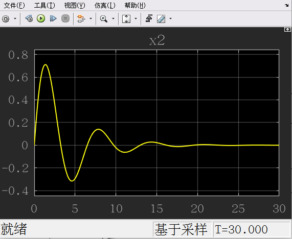
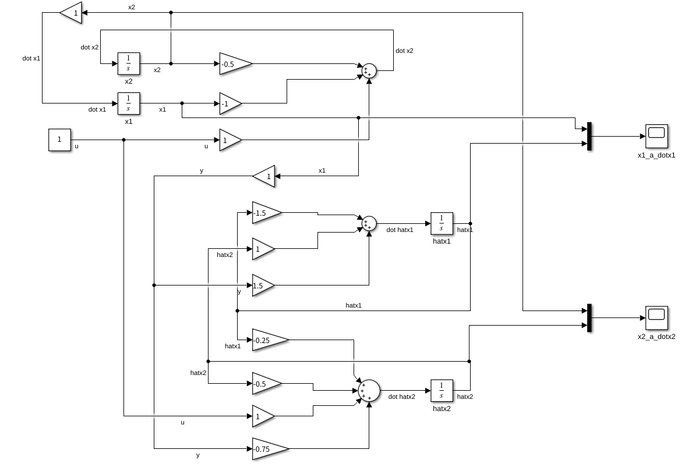
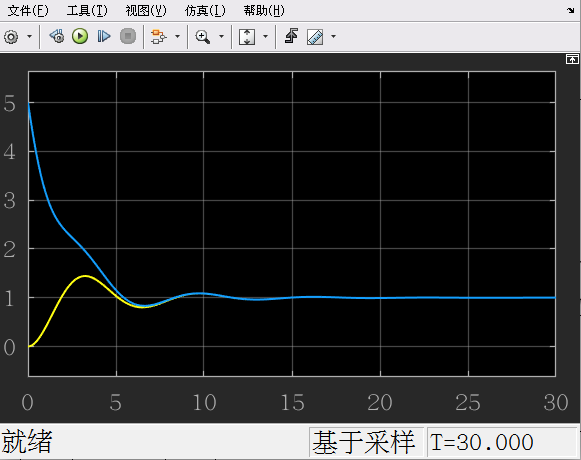
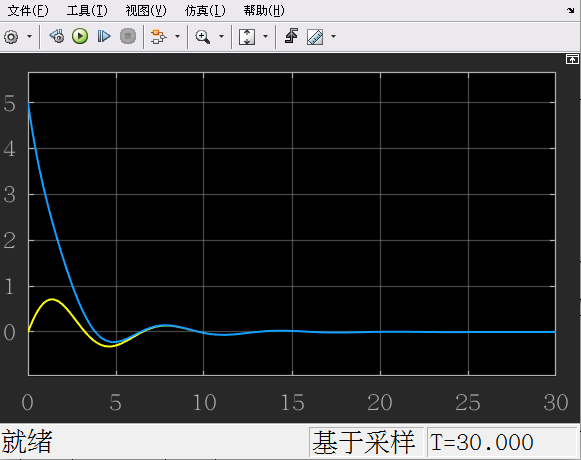

## 观测器的 matlab 仿真

上节课系统的动力学方程：
$$
\begin{aligned}
\begin{bmatrix}\dot x_1 \\ \dot x_2 \end{bmatrix} 
&= 
\begin{bmatrix}0 & 1 \\ -1 & -\frac12\end{bmatrix}
\begin{bmatrix}x_1\\ x_2 \end{bmatrix}
+
\begin{bmatrix}0 \\ 1\end{bmatrix}
u \\
y &= \begin{bmatrix}1 & 0 \end{bmatrix}\begin{bmatrix}x_1 \\ x_2 \end{bmatrix}\\
\end{aligned}
$$
在matlab中构建状态方程

在输入恒为 1 时，系统的状态

### 设计观测器

搭建上节课设计的观测器的matlab仿真
$$
\begin{bmatrix}\dot{\hat x}_1 \\ \dot{\hat x}_2\end{bmatrix}
=
\begin{bmatrix}-1.5 & 1 \\ \ -0.25 & -0.5 \end{bmatrix}
\begin{bmatrix}\dot{\hat x}_1 \\ \dot{\hat x}_2\end{bmatrix}
+
\begin{bmatrix}0 \\ 1\end{bmatrix}u 
+ \begin{bmatrix}1.5 \\ -0.75\end{bmatrix}y
$$
在matlab中建模：

我们让初始的预测值偏离实际值5，观察预测状态和实际状态

- 两张图分别是 x1和 x2的实际（黄色）和预测（蓝色）

可以看出，预测值在不断接近实际值

得到的观测器对系统有一个很好的估计

---

