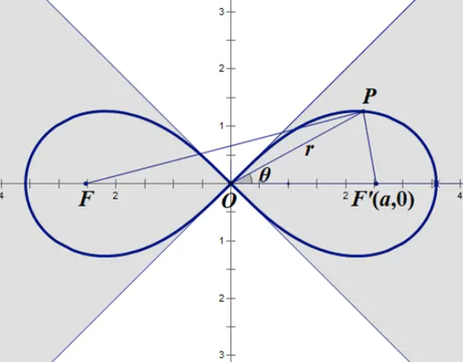
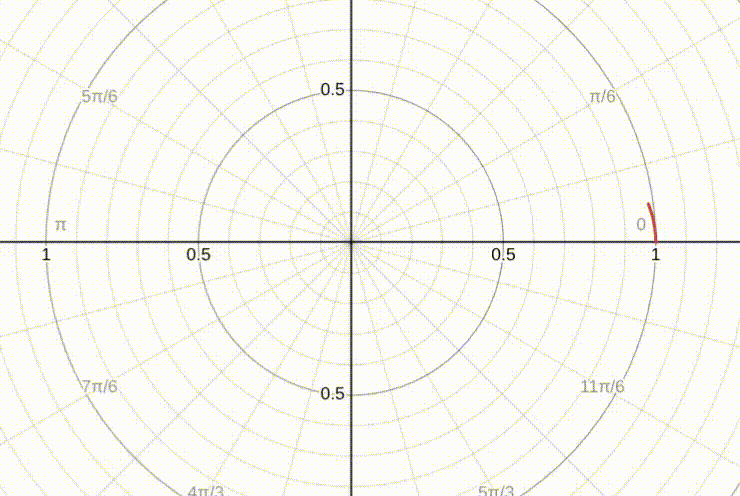

## 无人机以 伯努利双纽线 为轨迹绕8字，进行运动控制

1. 数学部分：

   伯努利双纽线的表达式：

   - 直角坐标系
     $$
     (x^2+y^2)^2 = 2a^2(x^2-y^2)
     $$
     
   - 极坐标，其中 $\theta \in [-\frac{\pi}{4}, \frac{\pi}{4}] \cup [\frac{3\pi}{4}, \frac{5\pi}{4}]$
     $$
     r^2 = 2a^2cos2\theta
     $$
     
   - 函数图像
   
   
   
   由于我们要沿着双纽线飞行，所以我们要先表示x、y，我们先用极坐标 $\theta $ 来分别表示x、y
   
   - 极坐标和直角坐标的关系
     $$
     \begin{cases}
     x = r\,cos\theta   \\
     y = r\,sin\theta   \\
     \end{cases}
     $$
     
   - 根据前面的关系式，我们能得到
     $$
     \begin{cases}
     x = a\sqrt{2cos2\theta}\,cos\theta   \\
     y = a\sqrt{2cos2\theta}\,sin\theta   \\
     \end{cases}
     $$
   
   但随之而来的有一个问题， $\theta$ 从小到大画出来的轨迹，不是按照我们直觉中的 8 的书写顺序来的。这样做出来的轨迹不利于飞控控制，且运动效率很低，所以我们要做的是把极坐标方程转换成参数方程
   
   
   
   -  为了将极坐标方程转换为参数方程，我们引入参数 *t*，并令：
      $$
      tan\,t = tan\, \theta
      $$
   
   -  其中
      $$
      t = \theta + k\pi \,\,\,\,\,\,(k\in \Z)
      $$
      

