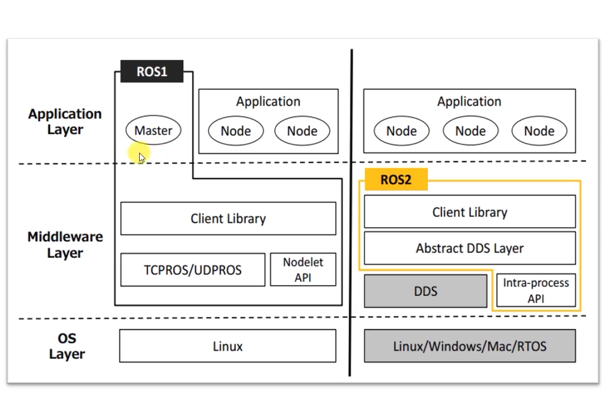
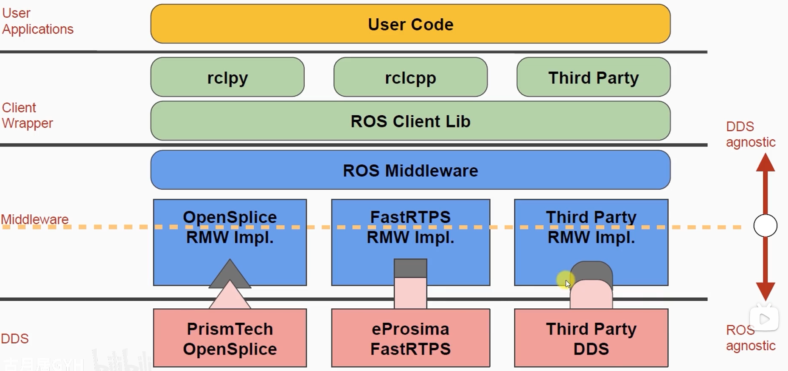

DDS 的学习笔记

# DDS

## 一、DDS 包含了什么？

#### 1. 核心：协议（DCPS）

协议规定了数据如何格式化、如何发现彼此、如何传输、如何保证可靠性等。

#### 2. 实现：中间件

一些实现了 DDS 协议的库，比如Fast DDS、CycloneDDS、RTI Connext等

| DDS             | 特点             |
| --------------- | ---------------- |
| **Fast DDS**    | ROS 2 官方默认   |
| **Cyclone DDS** | 延迟低、行为稳定 |
| **RTI Connext** | 工业级、可认证   |
| **GurumDDS**    | 低延迟、嵌入式   |

## 二、ROS1 和 ROS2 通信比较



在ros1节点是中心化的，所有节点都依靠roscore，使用TCP/UDP通讯

而ros2是去中心化的，master没了，节点之间的通讯是通过DDS

- 自发现

  DDS 使用了 **RTPS (Real-Time Publish-Subscribe)** 协议。在 ROS 2 中，当你启动一个节点时，它会通过 DDS 协议向网络广播自己的存在。其他节点接收到信号后，双方会自动“握手”并建立连接。这消除了 ROS 1 中对 `roscore`（中心节点）的依赖，实现了去中心化。

- 数据传输

  DDS 负责数据的序列化（把代码里的对象变成字节流）和物理传输。支持传统的 **网络传输（UDP/TCP）**和 **共享内存（在同一台机器上）** 来绕过网络协议栈

- 服务质量控制（QoS）

​	管理数据怎么发送，配置数据流的不同规则

## 三、ROS2 DDS调优

### 1. 选择DDS框架

终端 `export`要使用的 DDS

```bash
export RMW_IMPLEMENTATION=rmw_cyclonedds_cpp
```

选择 Cyclone DDS 作为中间件

### 2. DDS 配置文件*

为要使用的DDS配置文件

以 Cyclone DDS 为例：

```xml
<CycloneDDS>
  <Domain>
    <General>
      <AllowMulticast>false</AllowMulticast>
    </General>

    <Internal>
      <ThreadPool>
        <Size>1</Size>
      </ThreadPool>
    </Internal>

    <Discovery>
      <ParticipantIndex>auto</ParticipantIndex>
    </Discovery>
  </Domain>
</CycloneDDS>
```

这个文件决定了 Cyclone DDS 的配置，包括：DDS 用几个线程（1个）、是否用 multicast（false）、分配参与者索引（auto）

将上面写成xml文件`cyclonedds.xml`，然后在 launch 里：

```python
SetEnvironmentVariable(
    name='CYCLONEDDS_URI',
    value='file:///.../cyclonedds.xml'
)
```

就能应用配置了

### 3. ROS2 包里的Qos（DDS 行为入口）

这不算DDS调优的内容，但是写 DDS 配置文件之前应该是要看的。QoS 是 ROS 2 的抽象，不是 DDS 的原生 API。

比如

```cpp
rclcpp::QoS qos(1); // 创建一个 QoS 对象，设置历史深度为 1
qos.best_effort(); // 设置可靠性策略为：消息尽最大努力传递，但不保证一定到达
qos.durability_volatile(); //设置持久性策略为：发布者只向当前已连接的订阅者发送消息
```

Qos单独设了置一个话题的话题策略，相当于是告诉DDS这个话题想要怎么样的行为

**ROS 2 的 QoS 是“跨 DDS 的统一抽象”。**

对于不同的DDS，ros2只需使用QoS，就能跑不同的DDS




 **每个 RMW 实现负责把“统一 QoS”翻译成自己要使用的 DDS 的配置**。怎么知道要用哪个DDS？就使用前面说的终端 `export`。

