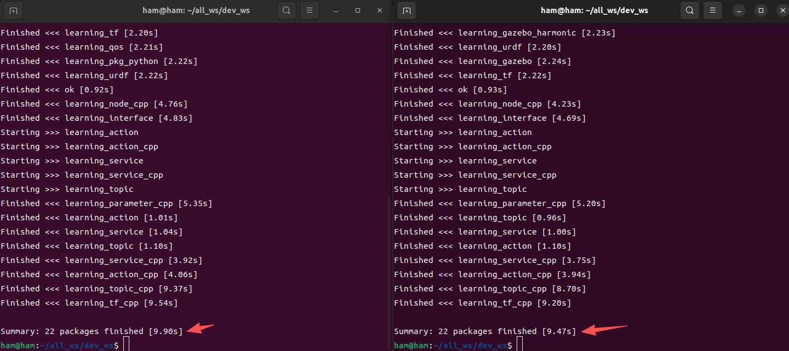

# 1. 使用 Ninja 构建 CMake 的后端

> environment：
>
> ​	ubuntu 22.04
>
> ​	ros2-humble
>
> ​	colcon-cmake 0.2.29

Download:

```bash
sudo apt-get -y install ninja-build
```


## Ninja 是什么？

一个比 Makefile 更快、更现代的构建系统。

两者本质上是 **CMake 生成的“构建后端（generator）”**：它们负责把 CMake 的构建描述（规则、依赖、编译选项）转换成具体能运行的构建脚本（Makefile 或 Ninja 文件），然后调用底层编译器（`g++`/`gcc` 等）来编译源代码。


## 在 ros2 中使用 Ninja 

命令：

```bash
cd path_to_workspace
colcon build --cmake-args -G Ninja
```

> [!NOTE]
>
> 请注意，CMake 不允许同一个 build 目录混用不同的构建系统
>
> 如果之前使用了 `colcon build  （默认用 Makefiles）` 的话，就要先删掉工作目录下的 `build/ install/ log/` 文件夹，重新打开一个终端，再编译
>
> 

实例：编译一个小型 ros2 项目



分别使用 Makefile（左） 和 Ninja（右）来构建cmake后端，可以看出 Ninja 是要比 Makefile 快一点点的


# 2. 生成 ros2 的 compile_commands.json 文件

- 作用：生成工作空间的 compile_commands.json 文件可以让 IDE 更方便地跳转代码


命令（整合了前面的Ninja）

```bash
colcon build --cmake-args -DCMAKE_EXPORT_COMPILE_COMMANDS=ON -G Ninja
```


> 注：空的 roscpp 包（`CMakeLists.txt` 里没有 `add_executable` 或 `add_library`）是无法生成 `compile_commands.json` 的，这会报警告
> ```bash
> CMake Warning:
>   Manually-specified variables were not used by the project:
> 
>     CMAKE_EXPORT_COMPILE_COMMANDS
> ```
>
> 这是正常的

在 `\build` 下能找到 compile_commands.json 文件说明构建成功


在 clion 中通过 `compile_commands.json ` 构建自己的 roscpp 项目：https://www.jetbrains.com/zh-cn/help/clion/ros2-tutorial.html#build-pkg
