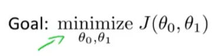
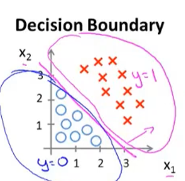
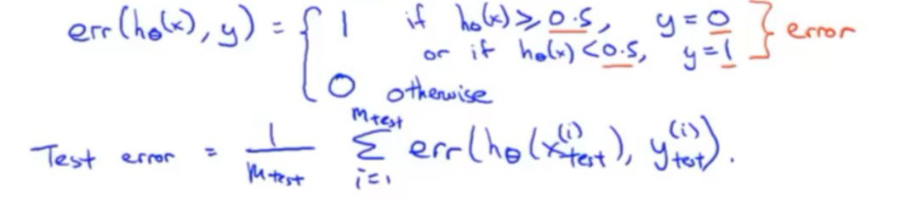

# 深度学习

找一个函数，达到类型的转换

Self-supervised Learning: 在没标签的数据集内进行自我学习（如翻转，变色图片等），达到识别的目的

# 机器学习

# Supervised learning（监督学习）

给算法一个数据集，其中包含正确的答案

如：预测房价，判断肿瘤恶性还是良性

## 回归问题

目标是预测一个连续值输出，如预测房价

### 单线性回归

常用手段：平方误差**代价方程**

1. 假设函数 (Hypothesis)

    假设函数：参数已经确定的函数（红框内）

    

2. 参数 (Parameters)

    假设函数中设的假设量

    

3. 代价方程 (Cost Function)

    代价方程：关于参数的函数，评价不同参数的好坏

    

    最终令参数方程最小为目标

    

    等高线图：根据代价方程的值，（两个）参数为横纵坐标，画出等高线（能更直观看出代价方程随参数的变化）

    

4. Batch 梯度下降法

    本质：找局部最优解

    更新参数：

    

    - alpha: learning rate（梯度下降速率，控制多大幅度更新参数，为正数）

    - 使用temp储存参数更新值，方便**同时更新**参数值

    - 右侧为参数函数的偏导

### 多元线性回归（多特征量x）

1. 假设形式：

    

2. 多元代价方程：

    

3. 多元梯度下降：

    

    1. 多元梯度下降法1：特征缩放

        目的：使不同参数量纲（值的范围）接近，减少收敛所需的迭代次数

        归一化：使特征值具有为0的平均值

        

        核心公式：
        
        

        u1：x的平均值

        s1：x的范围（最大值减最小值）

    2. 多元梯度下降法2：学习率(alpha)

    - 学习率很小，代价函数一定收敛

    - 但学习率太小，代价函数收敛会很慢

    

    解决方法：绘制代价函数随步数变化的曲线，并尝试一系列的alpha

### 正规方程

作用：一次性求解theta的最优解

方法：

1. 求导代价方程，将其导数置零

    

    

2. 使代价方程最小化公式（红框内）：

    

3. 最后更新theta的值

    

4. （番外）如果正规方程内的$(X^TX)$有不可逆的情况:

    ps：在Octave中，pinv函数为伪逆，即使不可逆也能计算，inv函数是逆

    为什么会出现$(X^TX)$不可逆：

    1. 其中两个特征值之间可以用线性方程联系起来

    2. 太多特征值，同时太少训练样本（例m <= n）

    解决：

    1. 查看有没有多余的特征

    2. 删掉一些不影响的特征，或者用**正规化**的方法

### 梯度下降 vs 正规方程

梯度下降|正规方程
---|---
要选择恰当的学习率alpha|不需要选择学习率
需要进行很多次迭代算出theta|不需要迭代
特征向量x很多的情况下计算结果很好|计算矩阵的时间复杂度为O(n^3)，所以特征向量很多的情况下会算的很慢（不过以目前算力，计算1000*1000的矩阵还是很快的，从10000左右开始变慢）

## logisti 回归解决分类问题

预测离散值输出，如判断肿瘤恶性还是良性

### logisti 回归

1. sigmoid/logisti函数

    1. 原型

        $\theta$ 和 $x$ 为列向量

        

    2. 范围

        

    3. 函数图像
    
        横坐标为 $z(\theta^Tx)$ ，纵坐标为$h_\theta(x)$的输出

        

    4. 含义

        **$h_\theta(x)$ 的输出就是y = 1的概率**！！！（y = 1 和 y = 0对应着不同的事件/类别）

        

2. decision boundary（决策边界）

    如果 $h_\theta(x)$ 的输出大于等于0.5，则预测 y = 1，对应 $\theta^Tx \geq 0$

    如果 $h_\theta(x)$ 的输出小于0.5，则预测 y = 0，对应 $\theta^Tx < 0$

    

    

    当 $\theta$ 确定后，画出特征值 x 和 $\theta^Tx \geq 0$ 的图像，其中 $\theta^Tx = 0$ 的直线即为决策边界

    1. $\theta$ 确定
    
        

    2. 带入假设函数

        

    3. 选择预测事件

        

    4. 绘制决策边界

        

        决策边界不是训练集的属性，而是假设本身及其参数的属性

    5. 更复杂的决策边界：

        可以在特征中添加额外的高阶多项式项

        比如二阶多项式

        

        或者是更高阶……

        

        得到很复杂的决策边界

### 拟合logistic回归（确定$\theta$）

1. 平方代价函数如下：

    

    由于 $h_\theta(x) = \frac{1}{1+e^{\theta^{T}x}}$ 为非线性函数，带入原始的平方差代价方程后，画出的平方代价函数有很多的局部最优解，直接梯度下降不能保证收敛到局部最小值，想让代价函数变成弓形

    就有如下代价函数

2. logistic回归代价函数

    式子：

    

    图像（y = 1）：

    

    横坐标为 $h_\theta(x)$（ y = 1 发生的概率），纵坐标为其代价，可以看出，$h_\theta(x)$ 为 0 时，y = 1 一定发生，对应的代价方程为 0

    

### 简化代价函数

将 y = 1 和 y = 0 两种情况合并：

（由极大似然法得来）

### 梯度下降

公式：

求出偏导：

### 高级优化（梯度下降以外的算法）

优点

线搜索算法，更复杂，不用选学习率，收敛快：

调用相关函数即可

### 多类别分类问题

例：

1. 将其拆分为一对多，训练出三个分类器

    

    

2. 选择分类器：

    将数据带入三个分类器中，选择 $h_(\theta)(x)$ 最大的类别（最大的值即为最高的概率）

    

## 正则化

### 过拟合问题

过拟合问题会在变量过多的时候出现，拟合函数的代价方程虽然很接近于零，但是拟合函数很难泛化到新的样本数据上

解决：

1. 减少变量数量

    人工检查变量，留下重要的特征变量，舍弃不重要的特征变量

2. 正则化

    减少特征向量的量级或 $\theta_j$ 的大小

### 正则化的实现

ps：更小的参数derta能让模型更简单

在代价方程后面加一个新的正则化项，来缩小**每个**参数的值

从 1 到 n 求和（不用给 $\theta_0$ 增加惩罚项）

- 正则化参数 $\lambda$ 的作用：

    控制两个不同目标之间的取舍（平衡）

    目标1：更好拟合训练集

    目标2：保持参数 $\theta$ 尽可能小，避免过拟合

### 正则化推广到线性回归

梯度下降

合成后的式子：

通常而言，$(1 - \alpha \frac{\lambda}{m})$ 是一个很接近于 1 的数（小于1），因为 $\alpha$ 往往很大而 $m$ 往往很小 

### 正则化推广到正规方程

公式：

### 正则化推广到logistic回归

公式：

其中，与正规化回归方程不同的是：

回顾：

正规方程作用：一次性求解theta的最优解

### 正则化的代码实现思路

## 支持向量机（SVM）

作用：与logistic回归相似，给目标分类

不同点：

1. 代价函数：

    logistic回归代价函数：

    

    向量机的代价函数：
    少了 $\frac{1}{m}$

    

    图像：（y>1）（紫线）

    

    优势：模型简化，计算量小，更简便

2. 正则化参数：

    logistic回归

    

    

    向量机：

    

    C相当于 $\frac{1}{\lambda}$

    

3. 输出

    logistic回归：输出概率

    向量机：直接预测 $y=0 / y=1$

### 间距分类器

为确保正确分类，支持向量机的 $\delta^{T}x$ 不是大于零就可以，而是需要远大于0 比如大于等于1（相当于在向量机中构建了一个安全因子）

### 核函数

1. 不同的相似度函数就叫核函数

    

    图中的核函数为高斯核函数

    - 标记点：$l^{1}$ 为标记1，表示定义的新特征

    - 相似函数：$similarity()$ （一般写成 $k(x, l^{i})$ ）为度量训练样本x与和标记1的相似度

2. 相似函数是衡量x到标记l的相似度，如果x接近于标记l，那么**特征f**就非常接近于1

    

3. $\sigma^2$ 是高斯核函数的参数。$\sigma^2$ 越大，对应的从点 $l^{1}$ 移走时，特征值减小的速度会比较慢

    

4. 当接近标记点中的任意一个时，预测值会接近1。得到红色范围的非线性边界，称为决策边界

    ？为什么决策边界没有考虑 $l^(3)$

    

5. 如何得到 $l^{(i)}$

    将每一个训练样本作为标记点

    

6. 训练特征 $f_j^{(i)}$

    $f_j^{(i)}$ 代表以第 i 个训练样本作为标记点，对应的第j个训练样本的相似函数

    

    当然，$f_i^{(i)}$ 的特征一定等于1

7. 将核函数带入SVM中

    

    将 x 替换为 f ，再进行最小化代价函数的计算

    小细节：正规化方程的时候将 $\theta^T\theta$ 换成了 $\theta^TM\theta$ ，使计算更快

    

### 优化正规参数C、高斯核函数$\sigma^2$

- 大C模型为高方差，对应着过拟合

- 小C模型为高偏差，对应着欠拟合

- 大 $\sigma^2$ 模型更光滑，为高偏差，对应着欠拟合

- 小 $\sigma^2$ 模型更陡峭，为高方差，对应着过拟合

### 内核函数

1. 线性内核函数

2. 高斯内核函数

    

    注意：在使用高斯内核函数之前要将特征变量的大小按比例归一化

3. 多项式核函数

4. 字符串核函数

5. 卡方核函数

6. 直方相交核函数

    

### 多分类函数

### 默塞尔定理

不是所有你提出来的核函数都是有效的核函数，这些函数都要满足一个技术条件——默塞尔定理

### 选择 logistic回归 or SVM 的参考

- n = 特征数，m = 训练样本数

1. 如果n很大(相对于m): (如：n > m，n = 10000，m=100)

    使用逻辑回归，或不带核的SVM(线性核函数)

2. 如果n很小，m大小适中: (n = 1 - 1000，m = 10 - 10000)

    使用高斯核函数的SVM

3. 如果n很小，m很大: (n = 1 - 1000, m = 50000)

    创建/添加更多特征，然后使用逻辑回归或不带内核的SVM

- 虽然神经网络可能在大多数这些设置中工作得很好，但可能训练得比较慢

# Unsupervised learning（无监督学习）

数据集**没有标签**，自动找出数据的结构

## 聚类算法

分簇

### K-Means 算法

1. 步骤：

    

    如果出现没有点的簇中心，一般是将簇中心去除，如果实在需要可以重新初始化

2. 优化目标函数

    $c^{(i)}$ 为样本 $x^{(i)}$ 归属的簇的序号

    $u_{k}$ 第k个聚类中心的位置（1 <= k <= K）

    $K$ 代表簇的数量， $k$ 代表聚类中心的下标

    $u_{c^{(i)}}$ 代表 $x^{(i)}$ 归属的簇的中心位置

    

3. 避免局部最优

    初始化算法多次后，选择代价最小的一个

    

    当聚类数量 K 比较小时，多次随机初始化的效果会比较好

4. 选择聚类数量

    1. 肘部法则

        横坐标为聚类中心 K ，纵坐标为代价函数 J ，选择肘点（即拐点）的横坐标，作为 聚类中心 K 的大小

        

        但如果遇到平滑的曲线，可能就不太好用

        

    2. 根据后续市场的评估标准选择聚类中心 K

        

        比如选择衬衫的码数

## 降维

- 作用1：压缩数据，加速运行

    降维过程：建立新的坐标，将数据投影到更低的维度

    

- 作用2：可视化

    降到二维或三维可以绘制数据的图像

### 主成分分析（PCA）

1. 本质

    找一个低维平面，将数据投影在上面，并使蓝色线段的长度平方和（投影误差）最小。

    

2. 线性回归和 PCA 的区别

    如图

    

3. 步骤：

    1. 数据预处理 

        - 均值归一化和特征规范化

        

    2. 计算出矩阵sigma

    3. 运用函数，计算出矩阵 U 的值

    4. 如果要将维度降到 k 维，则取出矩阵 U 的前 k 个向量，组成矩阵 $U_k$

        

        （k：主成分数）

    4. 最终的结果：

        $z = U_k^{T} * x^{(i)}$

        

        z 矩阵即 x 经过主成分分析后的结果

4. 选择主成分数k的个数

    - 保留的方差

        

        一减等式右边为保留的方差的比例

    选择主成分数k的个数步骤：

    1. 从k = 1开始循环，取出矩阵S（S为对角阵）

    

    2. 图中关于矩阵S的计算就是关于保留方差的计算

    

    3. 比较不同k对应的保留方差的大小，保证k最小同时99%的方差被保留（根据具体再选择）

    

5. 原始数据的重构

    从低维数据回到原来维度的数据

    将原来的式子：

    

    进行逆运算即可：

    

    注意，与原来x的值相比，此处的x值已改变

6. 注意事项：

    运行PCA时，仅在训练集上的数据运行，不能用在验证集和测试集。当定义了x到z的映射后，就可以将这个映射到验证集和测试集

    不要滥用PCA：如用来防止过拟合，如上来就使用PCA而不先从简单的 $x^{(i)}$ 开始

## 异常检测

作用：检测可能异常的新数据

### 高斯函数（正态分布）

通过拟合高斯函数来模拟数据的分布情况

### 算法

步骤：

- $\mu$ 和 $\sigma$ 就是高斯函数中的符号

- 最后带入的 $p(x)$ 越大，数据越正常

- $\xi$ 为一个很小的数

最后只要测试数据带入 $p(x)$ 大于等于 $\xi$ ，即可认为正常数据，反之为异常数据

### 开发和评估异常检测系统

1. 准备工作

    需要一些已经有标签（标上正常和异常）的数据，并将这些数据分为训练、测试、验证集。

    

    - 异常数据全部分到测试集和验证集内

    - 这里令 y = 0 为正常数据，y = 1 为异常数据

2. 评估模型

- 将训练得到的模型用在测试集和验证集上，然后用评价估计法中的召回率和查准率或其他方法来评估模型的正确性

### 一个选择参数 $\xi$ 的方法

尝试每一个 $\xi$ ， 然后选出能最大化F1-score所对应的 $\xi$ 

### 异常检测 vs 监督学习

- 选择异常检测的情况

    > 非常少的正面例子(y=1) (0-20是这里常见的情况)

    > 大量的负面(y=0)例子

    > 许多不同“类型”新异常：任何算法都很难从正例中学习到新异常是什么样子的，未来的异常现象可能与我们迄今为止所看到的任何异常现象完全不同。

    例：欺诈检测、制造业(如飞机发动机)、监控数据中心中的机器

- 选择监督学习的情况

    > 大量正面和反面的例子

    > 足够多的正例让算法了解正例是什么样的，未来的正例可能与训练集中的正例相似。

    例：电子邮件垃圾邮件分类、天气预报(晴天/雨天等)、癌症分类

### 使用算法

1. 转换数据使其更接近高斯分布

    

    使用系统自带的函数

2. 如何得到异常检测算法的特征

    通过没判断正确的验证集和测试集来启发你去想出更多的特征来分类

### 多元高斯分布

1. 当两个变量之间可能存在正/负相关时，检测会不准确

    

2. 解决：建立统一的 $p(x)$

    

    - $\Sigma$ 为协方差矩阵，$\mu$ 为n为变量，通过改变 $\Sigma$ 和 $\mu$ 的大小来得到不同的分布

3. 计算新的 $p(x)$ 即可

    

- 选择原始模型还是多远高斯分布？

    - 原始模型

        >优点：计算量小，
    
        >使用：可以在样本量较少时使用

    - 高斯多元分布

        >优点：能捕捉相关性特征

        >缺点：计算量大

        >使用：在需要捕捉相关性特征，且样本量远多于特征值（10倍），且特征值不大时

    ps：在需要捕捉相关性特征时，常用的做法是在原始模型上手动设计一些新特征，（新特征由原来的特征加减乘除得来）来捕捉异常的组合值

## 基于内容的推荐算法

基于已知的数据来预测未知的数据

## 协同过滤（推荐算法）

1. 找到人或物品之间的相关性

2. 秩矩阵分解 

3. 描述物品或人之间的相关性

$x^{(i)}$ 为电影 i 的特征向量，两部电影的相关性可以用两部电影间的欧式空间来表示

4. 均值归一化

如果一个用户缺少全部评分，经过协同过滤后预测评分会为零，不好进行推荐，于是协同过滤之前先归一化，看情况按行或按列归一化

## 神经网络

所做的事情类似于逻辑回归，实际上就是不断以新算出来的激活项作为新的训练集，继续往下算激活项，直到输出层

### 术语

1. 逻辑单元：将神经元模拟成逻辑单元

2. 激活函数：指代非线性函数 $g(z)$

    

3. 权重：就是模型的参数 $\theta$

4. 激活项：一个具体的神经元计算并输出的值，本质上是一个逻辑函数的计算结果

5. 架构：神经元之间的连接模式

### 前向传播

从输入单元的激活项向前传播给隐藏层，算出隐藏层的激活项，再向前传播

下图中 $x_0$ 为偏置单元/偏置神经元

符号：

- $a^{(j)}_i$ ：第 j 层第 i 个激活项

- $\theta^{(j)}_{mn}$ ：控制从第 j 层第 m 个激活项到第 j+1 层第 n 个激活项的映射

    

    

最终激活项为signmoid函数值：

$\theta^{(j)}_{mn}$ 矩阵的大小

向量化的实现方法（右下面）：

### 神经网络的代价函数

作用：拟合参数

回顾：logistic函数的代价函数

神经网络的代价函数

其中，我们不会将 $\theta^{(j)}_{mn}$ 中n为零的项加到正则项中，原因：

 n 为零的 $\theta^{(j)}_{mn}$ 总会乘一个类似于 $x_0$ 的类似偏差单元的项，我们并不想正则化这些项（不过加不加差别都不大）

### 反向传播算法

- 目的：计算偏导项

    

- 方法：从输出层开始，反向计算 $\delta$ 项

- 关于 $\delta$ 项

    符号 $\delta_j^{(i)}$ 代表第 j 层第 i 个误差项
    
     本质上是：代价函数 $cost(i)$ 关于所计算出的中间项 $z^{(l)}_j$ 的偏导数 $\frac{\delta}{\delta z^{(l)}_j}$

    

计算例子：

从 layer4 开始往前算 $\delta^{(i)}$

- 最终偏导项与计算出来的 $\delta^{(i)}$ 有关

    

计算算法：

1. 取出 m 个样本的训练集

    

2. 令误差项 $\delta_{ij}^{(l)}$ = 0

    

3. for 循环

    

    1. 用 $a^{(1)}$ 储存输入值

        

    2. 用正向传播计算出后面所有层的激活层 $a^{(l)}$

        

    3. 从后往前依次计算出对应的误差项 $\delta^{(l)}$ 直到 $\delta^{(2)}$ ，不考虑输入层的误差项。

        第一项为输出值减目标输出

        

        后面几项

        

        

    4. 用 $\delta$ 累积 m 个偏导项的值

        

        向量化的形式：

        

4. 计算 $D^{(l)}_{ij}$ 的值

    

    图中的 $\lambda$ 漏乘了1/m

    $D^{(l)}_{ij}$ 就是代价函数关于每个参数的偏导数

    

### 梯度检验

- 目标：检查正向、反向传播权算法的正确性，防止因为bug使结果误差过大

- 本质：通过计算偏导项的近似解，并与正向、反向传播权算法算出的偏导项进行比较，结果相近就说明算法正确

计算差分（偏导项的近似解）：

1. 双侧差分

    

2. 单侧差分（较少用）

    

3. 更普遍的情况：$\theta$ 为向量参数时

    

    用近似的思想估计所有的偏导数项

    

大致算法：

1. 用for循环计算出所有 $\theta$ 对应偏导数的近似解

（$thetaPlus(i)$ 代表第 $i$ 项的 $\theta$ 加上一个 $\xi$，其余照搬向量 theta）

2. 检查 $\theta$ 对应偏导数的近似解和反向传播所计算出来的导数DVec的是否相近

注意事项：

开始进行训练网络之前记得关掉梯度检验（因为梯度检验代码计算量非常大）

### 随机初始化

随机初始化原因：

    参数需要初始化值，如果参数初始化的值一样，那么所有的隐藏单元都一样，导致高度冗余，最后的逻辑回归单元只会得到一个特征，阻止了神经网络学习，因此要随机初始化

原理：

对每一个 $\theta$ 值初始化成一个范围在 $-\xi$ 到 $\xi$ 的随机值

### 总结

训练一个神经网络的大概步骤：

1. 选择一个合适的神经网络构架

2. 随机初始化参数

3. 使用前向传播算法得到输出值y的向量

4. 计算出代价函数 $J(\theta)$

5. 使用反向传播算法得到 $J(\theta)$ 的偏导项

6. 对反向传播得到的偏导项进行梯度检验，确保两种方法得到的值相近，最后停用梯度检验

7. 使用一个梯度优化算法，例如梯度下降、LBFG、共轭梯度等优化方法，和反向传播得到的偏导值结合使用，让代价函数最小，得到最优的 $\theta$ 值

## 评价估计

为测试模型准确性，将数据分为训练集和测试集（大概是7:3）

- 评价方式1. 测试误差：

    计算测试集的代价函数，来评价模型的好坏，适用于线性回归模型

    
    
    此处采用平方误差和计算测试误差

- 评价方式2. 错误分类、0/1分类错误：

    0 / 1分别表示预测的分类是正确 / 错误的情况

    

### 模型的选择，训练、验证、测试集

目的：为确定模型最优的多项式的次数，我们要确定不同多项式的次数是否有泛化性。

解决方法：我们先将不同次数带入，计算出模型。然后一一求解和比较模型的验证集误差，选择误差最小的模型多项式的次数（d）

- 总结：

    训练集误差：训练参数 $\theta$

    验证集误差：选择多项式次数 $d$

    测试集误差：评价模型的准确性

    大致比例：6:2:2

    

### 诊断偏差与方差

横坐标为多项式的次数，纵坐标为误差大小，分别绘制关于测试集误差和验证集误差的图像

可见欠拟合对应着高偏差，过拟合对应着高方差

#### 正则化的偏差、方差

目的：选择出一个合适的正则化参数 $\lambda$

方法：类似于多项式次数的选择。将不同的正则化参数 $\lambda$ 带入计算模型，然后计算并比较不同模型的验证集误差，选择误差最小的模型的正则化参数 $\lambda$ 

改变正则化参数 $\lambda$ 时验证集误差和训练集误差的变化：

关于方差、偏差的介绍：http://scott.fortmann-roe.com/docs/BiasVariance.html

#### 学习曲线

学习曲线：横坐标为训练数据的个数，纵坐标为代价函数的值

- 正常情况下

    

    可见，随着训练数据的增加，训练集误差越来越小，验证集误差越来越大

- 当处于欠拟合、高偏差时

    

    验证集误差和训练集误差都比较大。且随着训练数据的增加，验证集误差和训练集误差基本没变化

    **这说明欠拟合下，要提高模型的复杂度**

- 当处于过拟合、高方差时

    

    验证集误差和训练集误差之间有很大的差距。随着训练数据的增加，验证集误差和训练集误差越来越接近

    **这说明过拟合下，要增加数据，或者减小复杂度**

### 总结：

### 查准率Precision和召回率Recall

作用：评估模型的准确度，用于**不对称类分析的误差评估**

- 查准率：$\frac{将正类预测为正类的样本}{预测的正类}$

- 召回率：$\frac{将正类预测为正类的样本}{原本的正类}$

类似的，对于一个分类问题，可以使用正/假阳性来解决

查准率和召回率二者不可得兼：

- 查准率高：能减少预测出现错误的情况

- 召回率高：能预测到更多的对应事件

关于查准率和召回率博客：https://zhuanlan.zhihu.com/p/93586831

### F1-score

- $F1$ 分数

    F1分数（F1-score）是分类问题的一个衡量指标。一些多分类问题的机器学习竞赛，常常将F1-score作为最终测评的方法。它是精确率和召回率的调和平均数，最大为1，最小为0。

    $F1 = 2 ⋅ \frac{precision⋅recall}{precision+recall}$

- $F2$ 分数和 $F0.5$ 分数

    此外还有 $F2$ 分数和 $F0.5$ 分数。$F1$ 分数认为召回率和精确率同等重要，$F2$ 分数认为召回率的重要程度是精确率的**2倍**，而 $F0.5$ 分数认为召回率的重要程度是精确率的**一半**。计算公式为：

    $F_β = (1+β^2) ⋅ \frac{precision⋅recall}{(β^2 ⋅ precision)+recall}$

- G分数

    G分数是另一种统一精确率和的召回率系统性能评估标准，G分数被定义为召回率和精确率的几何平均数。

    $G = \sqrt{precision ⋅ recall}$

# 处理大量数据  

面对大量数据，如何改进算法加快运算速度？

## 随机梯度下降

- 本质

    将原来的m个样本求和得到的梯度项 改成 只要对单个训练样本求出这个梯度项 

- 算法实现：

    

## Mini-batch梯度下降 

一种介于批量梯度下降和随机梯度下降的算法

每次使用 b 个样本求和得到梯度项，b 为超参数

- 算法、

## 在线学习算法

根据现有数据流来不断优化算法

适合缓慢变化的对象，如顾客的品味

## Mapreduce

将数据分组，交给多台电脑并行计算

前提：只要学习算法可以表示成一系列的求和形式，或者表示成在训练集上对函数求和的形式

## 获取大量数据和人工数据

将图片人工拉伸或扭曲（添加人工失真）

